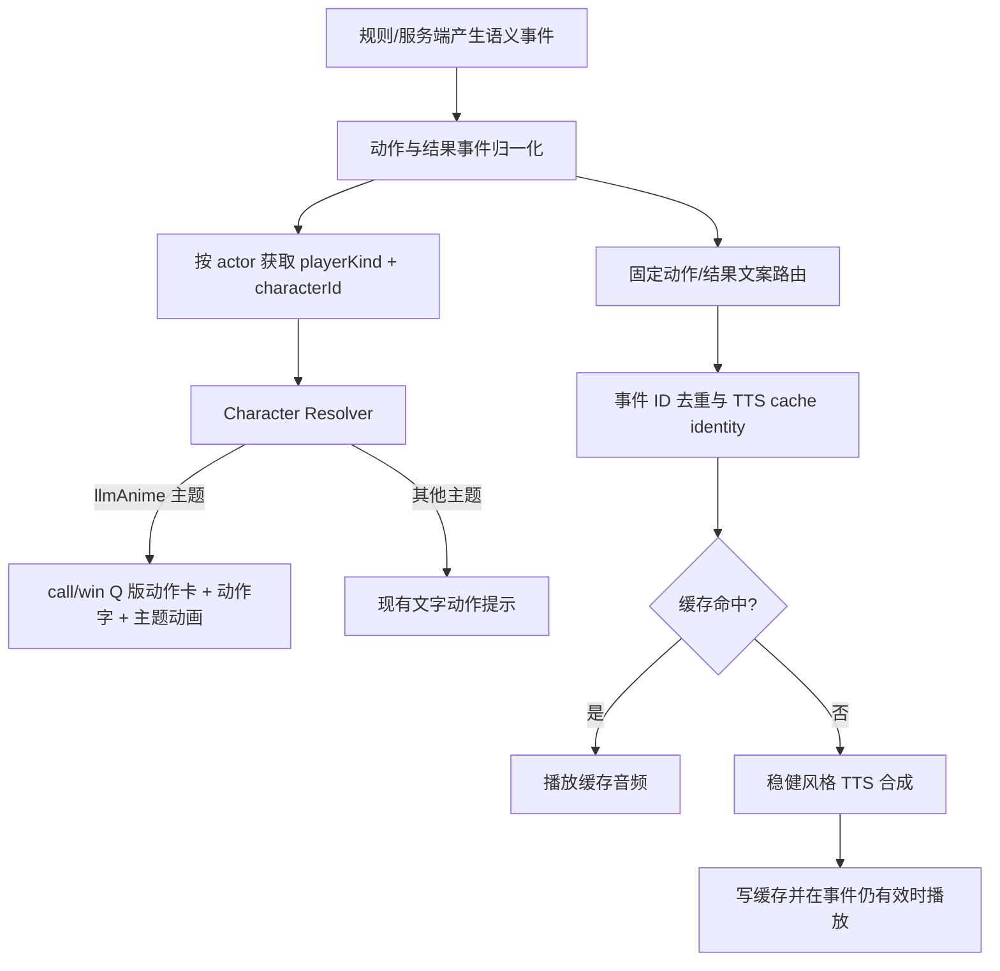

# 独立大模型二次元主题实施计划

> **后续方案更新（2026-09-04）**：后续全主题视觉改造以
> [`table-theme-presentation-refresh-plan.md`](./table-theme-presentation-refresh-plan.md)
> 为主规范。该方案明确“莲花”只指地方与玩法来源，不作为花卉、装饰或主题视觉母题；
> 同时要求删除独立“雀魂风”主题并把主动回归矩阵调整为五主题。本文其余内容继续作为
> `llmAnime` 已完成实现和历史响应式验收记录；其中关于竞品主题、六主题矩阵或以竞品名
> 描述未来要求的文字不再具有规范效力。

> 2026-08-31 3D 方向修订：`llmAnime` 保留鼠尾草桌面、墨色结构、奶油白麻将与珊瑚牌背配色，牌桌采用低写实商业 3D：圆角树脂牌体、环境高光、VSM 软阴影、34° 偏长焦机位与 ACES 色彩管理。Q 版角色牌、漫画气泡、座位附近的鸣牌切入和分镜式结算继续承担二次元身份表达。现有 `llm` 深蓝星轨主题保持不变。

> 状态：实施中，基于 2026-08-30 的前端、后端与素材审计。

当前进度：

- 已注册独立 `llmAnime` 主题，现有 `llm` 深蓝星轨主题保持不变。
- 已落地前后端 12 角色/固定文案/voice/fallback 合同与 DeepSeek 回退。
- 已接入单机本家选角、角色偏好持久化、WebSocket join 角色参数和角色动作 cue 骨架。
- 已撤销第三方字体方案，首版使用系统字体栈加 CSS/SVG 字效。
- 平时座位、选角、气泡与结算改为复用现有 Q 版头像；完整比例立绘不再作为主题运行时主资源。
- LLM 座位继续显示其激进/稳健/话痨/高冷策略头像；只有真人和普通 bot 使用基础稳健头像。
- 已生成并接入全部 12 角色共 24 张动作卡（每角色通用鸣牌卡 `call` + 通用胡牌卡 `win` 各一张，单张 228~343 KiB，成品审核通过）；动作卡资产缺口已关闭。
- 已把六类动作和五类赛后固定文案接入现有 TTS 缓存：主音色失败尝试替代音色，开始播放前动作最多等待 4.5s、赛后单句最多等待 2s；一旦开始播放不再截断。自定义聚合中转按完整模型 ID 识别角色（如 OrcaRouter 的 Claude）。
- 已落实 `llmAnime` 声音矩阵：真人只保留落牌声、普通 bot 继续报牌、LLM 保留普通出牌吐槽，动作和赛后不再使用模型自由文案。
- 已落地单机与 WebSocket 的四家赛后队列；赢家先说、其余顺时针，流局按座位顺序，队列结束后才开放结算窗口，取消/失败会立即放行。
- WebSocket 已增加连接级 `presentationAudioMode` 协商和 `purpose/speechSource` 元数据；二次元连接可提前收到结算，深蓝星轨继续走 legacy 动态语音。
- vibehub 共享声音策略可随 master 同步，但 P2P 真人选角和 P2P 连接级音频能力仍属于下一里程碑。

## 1. 目标

保留现有 `llm` 深蓝星轨主题及其行为，新增独立的 `llmAnime` 大模型二次元主题。默认墨玉、欢乐麻将、红木金丝和现有深蓝星轨主题的视觉、布局、游戏逻辑与声音行为均不被新主题替换。

本期目标包括：

- 新 `llmAnime` 主题专属字效、牌面、牌背、广播提示、气泡框、局结算和最终结算视觉。
- 吃/碰/杠共用每角色的 `call` Q 版动作卡，胡/自摸/抢杠胡共用 `win` Q 版动作卡，再叠加 DOM 动作大字与特效。
- 角色形象与 LLM 供应商、决策风格解耦。
- `llmAnime` 主题下，非 LLM 座位未指定角色时统一回退 DeepSeek 形象。
- 单机本家可选择角色；WebSocket 多人联机真人可选择角色，并让房内其他客户端看到一致结果。
- 吃、碰、杠、胡、自摸、抢杠胡使用固定文案和“稳健”风格走 TTS；首次合成后写入现有音频缓存，后续直接命中缓存。文案不由 LLM 临场生成。
- 真人出牌只保留实体落牌声，不报牌名、不进入 TTS。
- 胜、负、流局使用角色对应的固定文案走缓存 TTS；赢家先说，其余座位顺时针依次说。

## 2. 本期冻结的产品决策

### 2.1 视觉方案

角色资源分两层：

1. 平时展示直接复用现有 Q 版头像：座位、本家、真人选角、气泡旁角色和结算页保持同一 Q 版世界观；真人默认使用对应角色的“稳健”头像。
2. 每个角色只制作两张动作卡：`call` 覆盖吃/碰/杠，`win` 覆盖胡/自摸/抢杠胡；全套共 12×2=24 张。
3. “吃/碰/杠/胡/自摸/抢杠胡”文字仍由 DOM/CSS 绘制，确保文字准确、可响应式缩放；生成图片本身不烘焙动作字。
4. 鸣牌画面不显示角色昵称；昵称只出现在座位、选角和结算等身份区域。
5. 专用动作图缺失时回退本角色基础 Q 版头像，再回退 DeepSeek 基础 Q 版，最后回退纯文字 cue。

### 2.2 角色与模型解耦

- `characterId` 只控制角色视觉和固定声音。
- `providerId`、`model`、`style`、API Key 只控制 LLM 决策与普通吐槽。
- 真人选择角色不会使其变成 LLM。
- LLM 座位优先由供应商映射角色；映射失败回退 `deepseek`。
- 普通 AI、旧协议玩家、非法或缺失角色统一回退 `deepseek`。
- 禁止客户端提交任意图片 URL 或文件路径，只接受角色白名单 ID。

首版中文展示名冻结如下：

| characterId | 中文展示名 |
|---|---|
| `claude` | 克劳德书姬 |
| `deepseek` | 大肥鱼 |
| `doubao` | 豆包学妹 |
| `gemini` | 美国豆包 |
| `glm` | 智谱狐姬 |
| `gpt` | GPT龙姬 |
| `grok` | Grok小恶魔 |
| `kimi` | Kimi月姬 |
| `minimax` | MiniMax导演 |
| `mistral` | 米斯特拉风狐 |
| `muse` | 缪斯梦姬 |
| `qwen` | 千问大小姐 |

展示名只用于角色 catalog/UI，不改变 provider ID、模型名或 API 配置。

### 2.3 声音方案

“预设语音”按“固定文案 + 固定角色 voice key/speaker + 固定稳健风格”的缓存 TTS 解释。运行时允许调用 TTS 合成，但不把 LLM 自由回复作为动作或赛后文案；同一组合由现有 cache key 去重并复用。

- 动作语音：`chi`、`peng`、`gang`、`hu`、`zimo`、`qiangganghu`。
- 结果语音：`win-self-draw`、`win-discard`、`win-robbed-kong`、`loss`、`draw`。
- 每个角色首版共 11 个固定语音槽位，12 个角色共 132 个“文案 × 音色”可缓存组合，不再对应 132 个随前端发布的 MP3 文件。
- 角色普通出牌吐槽仍可保留现有 LLM 动态气泡/TTS，但动作和赛后发言不得使用模型自由文案 TTS，只能使用固定文案缓存 TTS。
- 在 `llmAnime` 主题下，真人不进入普通 LLM 吐槽或牌名播报链路；其他主题（包括现有 `llm`）保持当前牌名播报与动态 TTS 行为。
- 所有实体音效，例如落牌、牌面落位、胡牌特效，继续保留，但必须防止与固定人声重复播放。
- 角色 voice 不可用时使用 manifest 中已审核的替代 voice；TTS 请求失败或超时后，动作回退现有通用 `chi/peng/gang/hu/zimo` 人声（抢杠胡暂回退 `hu`），赛后只显示固定文字气泡并跳过人声。绝不回退 LLM 自由文案。
- 缓存键继续由标准化文本、固定“稳健”风格、TTS provider/voice profile 和 cache version 组成；角色文案、speaker 或音色配置变化时必须改变 cache identity。
- 并发的相同固定文案请求需要单飞合并，避免同一 cache miss 重复调用上游 TTS。
- 132 个组合可以在角色/文案合同验收后通过独立脚本预热缓存，但预热产物不进入前端 Git 资产。

### 2.4 主题边界

- 新主题 ID 固定为 `llmAnime`，主题选项文案为“大模型二次元”；内部资源目录仍使用 `llm-anime`，二者不要混用。
- 现有 `llm` 主题继续使用 `llmTheme`、`llm-table.webp` 和“大模型专属/深蓝星轨”选项，不修改或重命名。
- 当前“启用 LLM 且未明确选主题”的自动推荐继续选择现有 `llm` 深蓝星轨主题；`llmAnime` 首版只由用户明确选择，URL 为 `?theme=llmAnime`。
- 二次元视觉、真人禁报牌、真人赛后角色发言只在 `themeName === 'llmAnime'` 时生效。
- 角色 ID 始终随玩家身份保存和同步，即使当前客户端没有使用 `llmAnime` 主题；这样其他使用该主题的客户端仍能正确显示角色。
- 动作/赛后 TTS 必须携带明确的 `purpose/actionKind/speechSource`，区分“固定文案 TTS”和“模型自由文案 TTS”。
- `llmAnime` 客户端的动作/赛后人声走固定文案缓存 TTS；其他主题和旧客户端继续走现有动态/legacy 路径，具体通过连接级能力协商实现，见 §8。

## 3. 实施前审计基线与主要缺口（历史记录）

> 本表保留立项时的代码基线，实施后的最新状态以文首“当前进度”和各波次提交记录为准。

| 范围 | 当前实现 | 缺口 |
|---|---|---|
| 现有深蓝主题 | `App.vue` 设置 `data-table-theme="llm"`，3D 牌桌读取 `llmTheme` | 必须原样保留，并补视觉/声音回归测试 |
| 新二次元主题 | 当前不存在 `llmAnime` 主题 ID 或 registry 项 | 需新增独立主题、manifest、选择项和 URL 解析 |
| 桌面 | 现有 `public/img/llm-table.webp` 是深蓝星轨主题桌布 | 原图继续只服务 `llm`；`llmAnime` 使用独立 `table/surface.webp` |
| 字效 | 系统微软雅黑/苹方，部分位置声明未打包的 `Noto Serif SC` | 不再引入第三方字体文件；用系统字体、描边、渐变和阴影完成二次元字效 |
| 2D 牌面 | `tileAssets.ts` 固定读取 `public/tiles/` | 缓存没有主题维度，无法切换牌面 |
| 3D 牌面 | 与 2D 共用同一套牌图并生成 atlas | `llmTheme` 明确继承默认牌面 |
| 牌背 | 2D CSS 绿色渐变；3D Canvas 三色渐变 | 无图片牌背，2D/3D 需统一 |
| 广播 | `GameTableHud.vue` 纯文字条 | `llm` 无专属结构或边框资源 |
| 动作提示 | `table-action-cue` 圆形光效 + 文字 | 无角色、无动作图片、无资源回退 |
| 气泡 | `PlayerSeat.vue` 只覆盖三家对手 | 本家没有气泡节点；主题仅换颜色 |
| 结算 | `SettlementOverlay.vue` 共用版式 | `llm` 只换深蓝渐变，没有二次元布局 |
| 身份 | `GamePlayer` 只有 `avatar`、`isLlm?` | 缺 `characterId` 和明确的 `playerKind` |
| 单机本家 | seat 0 固定 `lotus.svg` | 没有本家角色偏好和 seed 接口 |
| 联机真人 | join 只传 nickname/playerId | 前后端协议没有角色字段 |
| 真人出牌 | 所有非 LLM 座位都会播牌名 | 与真人禁报牌需求冲突 |
| 吃碰杠 | LLM 屏蔽通用音效并改走模型台词 TTS | 与固定“稳健”动作语音冲突 |
| 赛后发言 | 只注册 LLM 座位，文字本地但音频运行时合成 | 真人无发言，且仍依赖 TTS 服务 |

## 4. 素材审计与资产合同

### 4.1 已有角色源图

源目录：`tmp/video/大模型二次元形象/`

共有 12 个角色：

`claude`、`deepseek`、`doubao`、`gemini`、`glm`、`gpt`、`grok`、`kimi`、`minimax`、`mistral`、`muse`、`qwen`。

已知问题：

- 目录共 14 个文件，约 8.75 MiB：12 张 JPEG（约 7.02 MiB）和 2 张 DeepSeek cutout PNG（约 1.73 MiB）。
- 12 张 JPEG 中，10 张为 1536×2752，`glm` 为 576×1024。
- DeepSeek JPEG 实际为 750×1344，文件名中的尺寸不准确。
- 只有 DeepSeek 有透明 cutout；`cutout-v2` 错误抠除了大量白色衣裙和头饰，必须弃用。
- 其余 11 位仍是白底 JPEG，需要逐张抠图并在深色、浅色、棋盘格背景上人工检查。
- 现有 `public/img/llm/` 有 11×4=44 张策略头像，均为 512×512，总计约 15.75 MiB；PNG 容器实际为 RGB、没有 alpha，且缺少 Mistral。
- 现有牌面只有 `public/tiles/` 的 34 张 75×100 RGBA PNG，总计约 0.43 MiB。
- 现有桌布 `public/img/llm-table.webp` 为 1024×1024 VP8L lossless，约 1.05 MiB。
- 代码目前只一等识别 DeepSeek、Kimi、Qwen、Doubao、MiniMax、GPT、GLM、Claude 八家；Gemini、Grok、Muse 只能手填 `avatarFolder`，Mistral 没有线上头像、provider 或 TTS 映射，`custom` 目录也不存在。
- 当前已存在 44 张基础 Q 版头像和 24 张动作卡（12 角色 × `call`/`win`），主题牌面与图片牌背亦已完成（`public/themes/llm-anime/v1/`）；本行原“DeepSeek 两张、其余 22 张动作卡未完成”的审计结论已于 2026-09-02 修正。
- 已有通用吃、碰、杠、胡、自摸语音，但它们不是 12 角色固定语音；没有独立抢杠胡语音。

`tmp/` 被忽略，不能成为可重复构建的唯一真源。Wave 0 必须把批准使用的原图和可用 DeepSeek cutout 移到受版本管理的 `assets-src/llm-anime/`；若版权或仓库体积不允许提交原图，则必须使用外部只读归档并在源 manifest 中记录 URL、SHA256、字节数和恢复步骤。`cutout-v2` 写入拒绝清单，不能被流水线误选。

### 4.2 源文件与运行时目录

```text
assets-src/llm-anime/
  README.md
  characters/<id>/                 （源文件归档；目前仅 deepseek 有 source.jpg、portrait-master.png）

public/themes/llm-anime/v1/
  characters/<id>/actions/
    call.jpg                       （12 角色 × 通用鸣牌卡）
    win.jpg                        （12 角色 × 通用胡牌卡）
  tiles/faces/1m.png ... 7z.png    （34 张主题牌面 PNG）
  tile-back.png                    （图片牌背）
```

> 2026-09-02 修正（实际布局）：本节蓝图中的 `manifest.json`、`SOURCES.json`、`ui/` 与 `actions/` SVG 资产并未落地。座位/选角/结算头像复用 `public/img/llm/<id>/`（经 `animeCharacterAvatarUrl` 解析，缺目录角色回退 deepseek——当前 mistral 即如此）；广播框、气泡、动作字、结算框均为 CSS + 系统字体实现，无 SVG 资产；所有 URL 由 `llmAnimeAssets.ts` / `tileAssets.ts` 硬编码 `v1` 版本路径 + `import.meta.env.BASE_URL` 解析。首版不包含字体资产；动作/赛后音频由 TTS 服务生成后进入现有磁盘缓存，不作为 public 构建资产。

### 4.3 主题 manifest

> 2026-09-02 同步修正：本节描述的 manifest 生成器蓝图未落地。实际实现为 `src/game/core/presentation/llmAnimeAssets.ts`（`LLM_ANIME_ASSET_VERSION='v1'` + `SHIPPED_ANIME_ACTION_CARD_CHARACTERS = ANIME_CHARACTER_IDS` 硬编码 URL 构建，见 `animeActionArtUrl`），角色/alias/voice/固定文案分散在 `animeCharacters.ts`、`animeCharacterPreference.ts` 与 TTS 文案模块中；仓库不存在 `manifest.json`、`SOURCES.json` 与 `llmAnimeThemeManifest.generated.ts`。若未来引入多版本/内容哈希长缓存，再按本节蓝图回补生成器。

`assets-src/llm-anime/manifest.json` 是可编辑的唯一真源；构建脚本生成 `src/game/core/presentation/llmAnimeThemeManifest.generated.ts`，业务代码不得手写第二份路径表。

```ts
export type CharacterId =
  | 'claude' | 'deepseek' | 'doubao' | 'gemini'
  | 'glm' | 'gpt' | 'grok' | 'kimi'
  | 'minimax' | 'mistral' | 'muse' | 'qwen'

export type AnimeVoiceKey =
  | 'chi' | 'peng' | 'gang' | 'hu' | 'zimo' | 'qiangganghu'
  | 'win-self-draw' | 'win-discard' | 'win-robbed-kong'
  | 'loss' | 'draw'

export interface CharacterProfile {
  id: CharacterId
  label: string
  providerAliases: string[]
  avatarUrl: string
  thumbUrl: string
  actions: Partial<Record<'call' | 'win', string>>
  voiceKey: string
  speaker?: string
  fallbackVoiceKey: string
  lines: Record<AnimeVoiceKey, string>
  ttsStyle: '稳健'
  accentColor: string
  objectPosition?: string
  actionScale?: number
}

export interface LlmAnimeThemeManifest {
  schemaVersion: 1
  assetVersion: string
  defaultCharacter: 'deepseek'
  fontStack: readonly ['Microsoft YaHei', 'PingFang SC', 'Noto Sans CJK SC', 'sans-serif']
  table: { surface: string }
  actions: Record<AnimeActionKey, string>
  tiles: {
    back: string
    faces: Record<TileType, string>
  }
  ui: {
    broadcastFrame: string
    bubbleFrame: string
    bubbleTail: string
    settlementBackground: string
    settlementFrame: string
  }
  characters: readonly CharacterProfile[]
}
```

生成器必须保证根 manifest 中恰有 12 条唯一角色记录、DeepSeek fallback 自身完整、provider alias 不冲突、34 个 TileType 显式列全、每角色 11 个 `AnimeVoiceKey` 固定文案显式列全、所有被引用文件存在，并拒绝未引用的派生文件。禁止依赖目录扫描或字典序推断牌面。后端维护相同版本的安全 ID/alias/voice catalog，并用 contract 测试校验集合一致，不拼接客户端传入的任意路径。

`assetVersion` 与 schema 版本分离。所有 public 资源位于带版本的目录，或由生成器使用内容哈希文件名；部署可以对这些 URL 使用 immutable 长缓存。校验器必须验证 manifest 引用的版本/哈希与实际文件一致，资源变化必须改变 URL，不能用固定 `portrait.webp` URL 配长期缓存。

### 4.4 冻结的派生规格

| 资产 | 规格 |
|---|---|
| 基础 Q 版头像 | 现有 512×512 头像作为座位/选角/结算主资源；逐步转为 WebP，单张目标不超过 60 KiB |
| 选择器缩略图 | 192×256 WebP，单张不超过 35 KiB，打开选择器后懒加载 |
| Q 版动作卡 | 每角色 `call`/`win` 各一张，1024×1024 方形、人物主视觉偏左、右侧保留动作字空间；源 PNG 无损保留，运行时 JPEG/WebP 单张不超过 350 KiB |
| 牌面 master | 384×512 RGBA；运行时至少 192×256 WebP，34 张逐键映射 |
| 牌背 | 512×704 WebP，2D/3D 共用设计 |
| SVG 字效/UI | 固定 viewBox，文字转路径；禁止脚本、外链、外部字体和远程图片 |
| 动作固定文案 | 1–8 个 Unicode code point，必须直接表达吃/碰/杠/胡/自摸/抢杠胡 |
| 结果固定文案 | 不超过 24 个 Unicode code point，覆盖三类胜利、失败、流局 |
| TTS 参数 | style 固定“稳健”；voiceKey/speaker 来自角色合同，失败使用已审核 fallbackVoiceKey |

首版不提交任何第三方字体文件。正文和标题统一使用系统字体栈，通过 `font-weight`、`-webkit-text-stroke`、渐变文字、叠层 text-shadow、轻微倾斜和动作字 SVG 外框形成二次元字效。字体加载失败不再是资源风险，动态玩家昵称自然使用系统字形。

Wave 0 先用 DeepSeek、Claude、Kimi 三张做编码基准，冻结 WebP 编码参数、SSIM/视觉阈值和 alpha 质量。若 300 KiB 在三张基准上无法稳定达标，则以“四座立绘总计不超过 2 MiB”为硬闸门并按实测上调单图预算，不得同时强制无损、300 KiB 和高细节三项互相冲突的目标。

### 4.5 资产加工闸门

资产 Agent 必须提供可重复运行的校验脚本，至少检查：

- 根 manifest 中恰有 12 条角色记录，每条都有基础 Q 版头像、缩略图、`call`/`win` 两个动作卡槽位、voice/fallback voice 和 11 条固定文案。
- 34 张牌面与 1 张牌背齐全。
- 专用动作图检查角色身份、Q 版比例、动作可读性、四肢/麻将牌正确性、右侧文字安全区和整体风格一致性；无需强制透明背景，可使用主题动作卡背景。
- 图片尺寸、体积和文件名满足规范。
- 132 个“角色 × 语音槽位”都能生成稳定的 TTS cache identity；重复请求命中同一缓存键，不重复调用上游 provider。
- 当前四座位只懒加载其角色图片；TTS 音频按事件请求并复用缓存，不在前端首屏预载。
- 专用动作图缺失时依次回退本角色基础 Q 版头像、DeepSeek 基础 Q 版头像、旧文字动作提示。
- voice 不可用时使用角色合同中的替代音色；TTS 失败时动作回退通用人声、赛后仅显示固定文字，绝不改用 LLM 自由文案。
- `SOURCES.json` / `ATTRIBUTION.md` 覆盖原图、cutout、派生图、动作/UI SVG、牌面、TTS 音色使用与缓存权限，并记录来源、工具/模型、音色、生成日期、许可证或授权证据。

建议预算：

- “未打开角色选择器”的大厅初始新增传输不超过 500 KiB。
- 打开选择器后懒加载 12 张缩略图，总新增传输不超过 500 KiB，并启用长期缓存。
- 单角色基础头像不超过 60 KiB，每张 Q 版动作卡不超过 350 KiB。
- 当前四座位动作资源总加载不超过 2 MiB。
- 固定文案 TTS 按事件懒合成；缓存命中后直接复用音频 URL/文件。

## 5. 目标数据模型

```ts
export type PlayerKind = 'human' | 'llm' | 'bot'
type ResolvedPlayerKind = PlayerKind | 'unknown'

export interface GamePlayer {
  // 现有字段省略
  characterId?: CharacterId
  playerKind?: PlayerKind
  isLlm?: boolean // 兼容旧协议，至少保留一个版本
}

export interface PlayerPresentationSeed {
  name?: string
  avatar?: string
  characterId?: CharacterId
  playerKind?: PlayerKind
}
```

统一解析规则：

```text
合法的玩家 characterId
  > 已知 LLM provider/avatarFolder 映射
  > deepseek
```

不要通过头像 URL、昵称或模型名反向猜测角色。

旧协议的 `isLlm === false` 或字段缺失不能单独区分真人和普通 bot，必须带上下文解析：

- 新协议：显式 `playerKind` 优先。
- 旧 WebSocket 联机：`isLlm === true` 为 LLM；否则服务器绝对座位存在于 `roomSeats` 真人集合时为 human，其余才为 bot。
- 单机：seat 0 为 human；seat 1..3 由当前 controller/runtime 注册信息判断 LLM 或 bot。
- 缺少上述上下文时返回 `unknown`，只做 DeepSeek 视觉回退，不能断言为 bot，也不能据此播放牌名。

为音频 exactly-once 增加稳定表现 ID：

```ts
interface TableActionEvent {
  id: number // 整个 GamePort/RoomSession 生命周期单调，不按局或场次重置
}

interface WireRoundResult {
  presentationId?: number // 阶段 A 兼容旧服务端；阶段 B 升为必填
}

interface NormalizedRoundResult extends WireRoundResult {
  presentationKey: string // 进入表现层后必填
}
```

后端 `presentationId` 在 RoomSession 全生命周期单调，连续开多场也不重置；本地在 GamePort 实例生命周期内单调。远端去重键为 `roomId:presentationId`，本地为 `localGameGeneration:presentationId`。断线重连和冗余 snapshot 复用原值；远端 `lastPlayedPresentationKey` 写入 sessionStorage/StoredSession，页面刷新后 resume 也不复播。

旧服务端缺少 ID 时：首次连接已经处于 settled/revealing 的快照不播放赛后语音；当前连接实时收到 hand result 时只生成 connection-local legacy key，刷新或 resume 后仍跳过，不伪造可持久化 ID。相关字段需要在 master、vibehub 的 keep 契约和后端分别接线。

## 6. 表现层架构



### 6.1 动作归一化

| 原始事件 | 展现键 | 文案 |
|---|---|---|
| `chi` | `chi` | 吃 |
| `peng` | `peng` | 碰 |
| `discard-gang`、`concealed-gang`、`added-gang`、`wind-kong`、`flower-gang` | `gang` | 杠 |
| `discard-win` | `hu` | 胡 |
| `self-draw` | `zimo` | 自摸 |
| `robbed-kong-win` | `qiangganghu` | 抢杠胡 |

先修正 `wind-kong` 在运行时 decoder 与 TypeScript 联合类型不一致的问题，再使用 exhaustive switch，避免新增类型静默落入错误资源。

### 6.2 动作组件

新增独立组件，例如 `AnimeActionCue.vue`：

- 输入：主题、动作事件、行动玩家、座位方位、reduced motion。
- 非 `llmAnime` 主题（包括现有 `llm`）继续渲染现有文字 cue。
- `llmAnime` 主题优先渲染对应角色/动作的专用 Q 版卡图，再叠加准确的 DOM 动作字、光效层和隐藏的无障碍文本。
- 鸣牌演出不显示角色昵称；专用图缺失时按“本角色基础 Q 版 → DeepSeek 基础 Q 版 → 纯文字”回退。
- 继续复用同一 `TableActionEvent`，不修改规则判定和副露牌落位动画。
- 首版动作严格在现有 1050ms 事件窗口内完成；如果未来需要更长演出，组件必须按事件 ID 快照并维护独立离场队列，不能依赖已经被清空的 `tableActionEvent`，也不能阻塞规则层。
- `prefers-reduced-motion` 下禁用位移、旋转和粒子，只做短淡入淡出。

### 6.3 字效、广播、气泡与结算

- 不使用 `@font-face` 或仓库内字体文件；在 `llmAnime` DOM selector 下对系统字体应用独立的渐变、描边、阴影和字距 token。
- 把 `llmAnime` 主题颜色、描边、阴影和字体做成独立 CSS 变量，不能覆盖现有 `llm` token。
- 广播使用主题边框、渐变遮罩和标题字体；保持 `aria-live` 文本。
- 气泡使用可伸缩九宫格/纯 CSS 框体和独立尾巴，四座位统一渲染；为本家新增气泡锚点。
- 结算页保留现有数据与按钮结构，只替换主题布局和装饰层，避免影响举报、继续、倒计时等行为。
- DOM 样式和字体应用仅在 `.game-app[data-table-theme="llmAnime"]` 范围生效；Three.js、牌面和牌背由显式 `themeName/tileSetId` 控制，不依赖 CSS selector。现有 `.game-app[data-table-theme="llm"]` 规则保持不动。

### 6.4 牌面和牌背

给主题增加资源集字段：

```ts
interface TableTheme {
  tileSetId?: 'classic' | 'llm-anime'
  tileBackTexture?: string
  // 现有材质字段保留
}
```

实现要求：

- 在 `TABLE_THEMES/TABLE_THEME_OPTIONS` 新增 `llmAnime`/“大模型二次元”，定义独立 `llmAnimeTheme`；现有 `llmTheme` 对象、选项值和资源引用保持原样。
- `TableThemeName`、URL 解析和主题选择器接受 `llmAnime`；`shouldAutoUseLlmTheme` 仍自动返回现有 `llm`，不得悄悄改默认推荐。
- `tileAssets.ts` 缓存按 `tileSetId` 分桶，切换主题不能复用错误图片。
- 2D `MahjongTile` 从统一主题上下文解析牌面，而不是每层手工传 34 个 URL；两条分支各自的 keep `App.vue` 都必须 provide 该上下文，结算、选牌弹窗和小牌组件通过 inject 自动取得 `tileSetId`。
- 3D 继续复用现有 atlas 管线，但使用对应资源集生成 atlas。
- 2D 暗牌与 3D 牌背使用同一张主题牌背设计。
- 主题切换失败时回退 classic，不阻断牌桌 ready。
- 更新当前断言“LLM 主题沿用默认牌面”的测试。

## 7. 角色选择与联机协议

### 7.1 单机

- 使用独立的版本化本地偏好，例如 `llm-anime.character.v1`，默认 `deepseek`。
- 不把真人角色选择写入包含 API Key 的 `LlmSettings`。
- 大厅在 `llmAnime` 主题下展示本家角色选择器。
- 把本地开局 seed 从“仅 AI 座位 1..3”扩展为明确的 `humanSeed + aiSeeds`，两套规则引擎共用。
- seat 0 使用本家选择并写 `playerKind: 'human'`；`runtime.ts::seedFor()` 为 LLM AI 写入 provider 角色和 `playerKind: 'llm'`；普通 AI seed 写 `playerKind: 'bot'` 并使用 DeepSeek 回退。

### 7.2 WebSocket 多人联机（master）

- 创建/加入房间前在昵称旁展示角色选择器；选择保存到本地 session。
- `joinRoom` 增加可选 `characterId`。
- `remoteLobbyController` 持有/读取角色偏好；`remoteRoomLifecycle.createRemoteRoom()` 在创建房间后内部 join 时也必须注入该值，普通 join 路径使用同一 getter，避免创建者漏传。
- `LobbyView`/`App.vue` 的状态接线由主 Agent串行完成，创建和加入 action 不各自维护第二份角色状态。
- `RoomSeatState`、房间响应、玩家快照、decoder、mapper 和断线重连结构增加可选 `characterId`、`playerKind`。
- 后端请求模型接受有长度上限的 string，再由白名单归一化；缺失或非法值回退 DeepSeek，不用 `Literal` 直接把旧值变成 422。
- LLM 空位从 provider 推导角色；普通 bot 为 DeepSeek；真人使用其选择。
- 旧服务端/旧客户端缺少字段时继续使用 avatar，并由新前端回退 DeepSeek。
- MVP 在加入房间时锁定角色；如以后需要进房后换角色，再增加带 `seat + rejoinCode` 的 profile 更新接口。

### 7.3 后端独立仓库

后端在 `backend/` 自己的 `main` 分支单独提交：

- `JoinRequest`、`SeatState`、room response、`_seeds()`、GamePlayer snapshot 增加角色和玩家类型。
- `app/models/game.py::GamePlayer` 显式接收新字段；`app/game/manager.py::_reset_players()` 每次开局/下一局从 seed 复制并保留新字段，不能只改 `_seeds()` 后在 reset 时丢失。
- 不复用当前外部随机头像 URL 作为动作角色来源；原头像在非 `llmAnime` 主题（包括现有 `llm`）继续保留。
- MVP 偏好由浏览器保存并随 join 发送，不需要数据库迁移。
- 若未来需要跨设备同步，再单独增加玩家 profile 字段。
- 协议字段先保持 optional，前后端可以滚动升级。

### 7.4 vibehub P2P

共享角色 catalog、`MahjongTile.vue`、`GameTableHud.vue`、新动作组件、主题 CSS/Three.js 文件和资产可从 master 自动同步；但实际同步脚本还会保留 `App.vue`、lobby、`SettlementOverlay.vue`、`gamePort*`、`online/protocol/**`、online orchestration/presentation/session/state、`shared/settlement/settlementTimeline.ts`、`lotusGame.ts` 等 vibehub 版本。

因此：

- 本计划先完成 master WebSocket 与独立后端。
- P2P 角色元数据传播作为下一里程碑的独立 vibehub 联机层任务处理，不阻塞本期 master WebSocket 验收。
- 结算结构若需要变化，优先抽出可同步的共享 `AnimeSettlementContent`，由两边 keep `SettlementOverlay.vue` 各自接入；如果只改主题 CSS，则无需改 wrapper。
- `RoundResult.presentationId`、协议和结算语音时间线需要两边分别接线；不得假设 master 提交会自动覆盖 keep 文件。
- 两边 keep `App.vue` 都必须各自 provide 主题上下文。
- 不得把 vibehub 的 transport 改造反向合并进 master。
- 在 P2P 任务完成前，验收报告必须明确“共享视觉已同步，P2P 真人选角尚未接线”，不能宣称双分支功能完全一致。

## 8. 语音策略矩阵

以下矩阵描述新 `llmAnime` 主题下的目标行为：

| 玩家类型 | 出牌 | 吃碰杠胡等动作 | 赛后 |
|---|---|---|---|
| human | 只播 `dapai`，无牌名、无自由文案 TTS | 自选角色固定文案缓存 TTS | 自选角色固定胜负/流局文案缓存 TTS |
| llm | `dapai` + 允许的普通吐槽；动作不使用模型自由文案 | provider 角色固定文案缓存 TTS | provider 角色固定结果文案缓存 TTS |
| bot | 继续保留现有牌名播报（已确认） | DeepSeek 固定文案缓存 TTS | DeepSeek 固定结果文案缓存 TTS |

其他主题（包括现有 `llm` 深蓝星轨）完整保留当前真人/普通 AI 牌名播报、LLM 动作 TTS 与赛后发言。真人禁报牌不是全局规则，只由表现层在 `llmAnime` 主题下启用。

防双播规则：

1. 动作固定语音只由 GamePort/RoomSession 生命周期内单调的 `TableActionEvent.id` 触发一次；销毁实例时清空去重集合，不按小局重置 ID。
2. 结果发言只由归一化后的 `presentationKey` 触发一次，重连快照和页面 resume 不得复播。
3. legacy 通用人声、模型自由文案 TTS、固定文案缓存 TTS 三者只能有一个人声出口。
4. 落牌、摸牌、牌组落位和胡牌特效等非人声音效不受影响。
5. 音效关闭、静音、缓存未命中、TTS 失败不得阻塞规则推进，并须立即放行结算窗口。
6. 赛后固定四家全员发言：赢家先说，其余从赢家起顺时针；流局按座位顺序。总时长控制在 8 秒内，单条建议 0.8–1.6 秒。
7. 权威分数与服务端 `settled` 仍先完成，但客户端保持亮牌态并等待四家本地发言；队列结束后才写入可见 `result/settled` 并打开结算窗口。theme change、卸载、终局或异常会取消队列并立即放行。

阶段 A 线协议字段保持 optional 以接收旧服务端；阶段 B/最低客户端覆盖后升为必填：

```ts
purpose?: 'commentary' | 'action' | 'round-reaction'
actionKind?: 'discard' | 'chi' | 'peng' | 'gang' | 'win'
speechSource?: 'model-message' | 'fixed-line'
presentationAudioMode?: 'legacy-dynamic' | 'anime-fixed-tts-v1'
```

### 8.1 两阶段发布策略

阶段 A（协议铺设）：

- 后端先给 message/audio 增加 `purpose/actionKind/speechSource`，暂时保留旧动作和赛后模型文案合成。
- 新客户端在 `llmAnime` 主题过滤 `speechSource: 'model-message'` 的动作/赛后音频，改为按角色固定文案请求缓存 TTS；其他主题仍按旧行为播放。
- 客户端连接、重连和主题切换时上报 `presentationAudioMode`；旧客户端或缺字段连接一律视为 `legacy-dynamic`。
- 无 purpose 的旧事件按旧客户端兼容路径处理，不能仅凭 priority 猜测。

阶段 B（连接级能力路由）：

- 后端按连接记录 `presentationAudioMode`，而不是把主题设为房间级状态。
- `anime-fixed-tts-v1` 连接按 actor 的 character、固定文案和“稳健”风格调用现有 TTS service；缓存命中直接复用，未命中只合成一次并写 room cache，然后只投递给 anime audience。
- 单机使用现有 `/api/local-tts` 与 local cache bucket；联机由 RoomSession 使用 room cache bucket 统一合成，避免四个客户端重复请求。
- 房间存在 `legacy-dynamic` 连接时，服务端仍按现有逻辑为 legacy audience 合成模型文案；混合主题房间可能同时需要一份 legacy dynamic 音频和一份 anime fixed-line 音频，二者按 audience 定向投递。
- 全部连接都是 anime fixed TTS 时跳过动作/赛后模型自由文案的 TTS，但仍允许固定文案在缓存未命中时调用 `ensure_audio`。
- 混合主题房间中，legacy 连接保留现有赛后语音和结算等待；anime fixed TTS 连接可先收到权威 settled 快照，但在本地四家固定文案队列结束前保持亮牌画面，不打开结算窗口。此处只做每连接表现屏障，不改变权威牌局 phase。
- 现有 `llm` 深蓝星轨主题始终上报 `legacy-dynamic`，因此视觉和声音行为保持不变。
- 普通 commentary 不受新动作/结果路由影响，仍按现有策略动态合成和播放。

动作 cache miss 的开始播放等待上限为 4.5 秒：覆盖主 TTS 音色正常冷启动，缓存命中时仍立即播放；超时才回退通用动作人声，后台合成结果只写缓存、不补播过期事件。赛后每句开始播放等待上限为 2 秒，超时显示固定文字后进入下一位。两个等待都只属于表现队列，不阻塞规则推进。

主题音频策略由表现层依赖注入到 `tileFlowExecutor`、本地结算适配器、remote transient presenter 和 snapshot reconciler；禁止在规则判定函数中读取 DOM、URL 或全局主题状态。

## 9. 多 Agent 分工与实施波次

当前并发上限为 4（主 Agent + 3 个子 Agent），按波次执行，避免多个 Agent 同时改同一文件。

### Wave 0：契约冻结（主 Agent）

- 冻结新主题 ID `llmAnime`、显示名、URL 与“自动推荐仍为现有 `llm`”的兼容规则。
- 冻结 `CharacterId`、`PlayerKind`、动作键、目录结构和语音矩阵。
- 冻结 `purpose/actionKind`、`presentationId` 和旧协议 kind 推断规则，并先提交共享 contract。
- 在资产生成前冻结 12 个 `characterId -> voiceKey/speaker/11 条固定文案` 映射，以及没有专属 voice 时的替代音色；Gemini、Grok、Mistral、Muse 不能留到 Wave 2 再决定。
- 建立 manifest schema、资源校验规则和兼容策略。
- 更新本文档中的开放决策。

验收：类型和 manifest contract 有单元测试；其他 Agent 不再自行新增别名或路径格式。

### Wave 1：资产与基础设施

| Agent | 文件所有权 | 任务 |
|---|---|---|
| 资产 Agent | `assets-src/llm-anime/**`、`public/themes/llm-anime/**`、资产脚本 | 抠图、裁切、牌面/牌背、UI 装饰、来源与资产报告；不生产字体或正式 MP3 |
| 角色契约 Agent | 新的 character catalog/manifest loader 与测试 | 角色白名单、provider alias、DeepSeek 回退、路径安全 |
| 主题底座 Agent | `tableTheme.ts`、`tileAssets.ts`、`MahjongTile.vue`、新主题上下文、3D 牌材质相关文件 | tileSet 分桶、2D/3D 资源集、主题加载失败回退 |

主 Agent 负责解决 manifest 与主题 loader 接口，并串行修改两边 keep `App.vue` 的 provide 接线；不允许资产 Agent 修改业务代码。

### Wave 2：视觉组件

| Agent | 文件所有权 | 任务 |
|---|---|---|
| 动作演出 Agent | 新动作组件、`GameTableHud.vue` 的 cue 接入及测试 | 六动作、四方位、失败回退、reduced motion |
| UI 主题 Agent | 广播、气泡、共享结算内容组件、主题 CSS | 系统字体字效、框体、本家气泡、响应式和无障碍；不直接假设 keep `SettlementOverlay.vue` 会同步 |
| 牌面验证 Agent | 牌资源/Three.js/Playwright 测试 | 2D、3D、结算小牌一致性和主题切换 |

三个 Agent 不交叉修改 `style.css`：UI 主题 Agent拥有主样式文件；动作 Agent 将组件样式先做 scoped，最后由主 Agent 统一 CSS token。

### Wave 3：身份与声音

| Agent | 文件所有权 | 任务 |
|---|---|---|
| 单机身份 Agent | 仅本地偏好、local opening/runtime/seed 文件 | seat 0 自选、AI 映射、两规则一致；不改 App/Lobby/共享 contract |
| WebSocket/后端 Agent | master room API/protocol/lifecycle/lobby + `backend/` | characterId/playerKind/purpose/presentationId 同步、白名单、重连兼容；前后端分别提交 |
| 声音 Agent | 仅共享 audio router、fixed-line TTS consumer、本地 audio policy 与测试 | 真人禁报牌、缓存键/单飞、固定动作/结果 TTS、防双播与超时回退；不改 online protocol |

共享 types、purpose、presentationId contract 已由 Wave 0 主 Agent提交。声音 Agent 不改规则判定，只消费语义事件；WebSocket/后端 Agent 不改共享视觉组件；两边 `App.vue`、keep `SettlementOverlay.vue` 和最终 Lobby 状态接线由主 Agent串行完成。

### Wave 4：集成与验收

- 主 Agent 合并各波次，解决跨模块接口。
- 验证资源体积、404、错误回退和音频队列。
- 运行完整前后端测试与视觉 E2E。
- master 每个完整前端提交后工作区保持干净并运行 `pnpm sync:vibehub`。
- 同步后在 vibehub 至少运行 typecheck、unit tests 和相关 P2P smoke/E2E；master 与 vibehub 的每个同步点都必须可编译。
- 后端在独立仓库单独提交，不与前端 commit 混合。

## 10. 推荐提交顺序

1. `feat(theme): register standalone llmAnime theme`
2. `feat(theme): add anime character catalog and asset manifest`
3. `feat(theme): add llm anime tile set and back texture`
4. `feat(theme): add anime action cue presentation`
5. `feat(theme): skin llmAnime announcements bubbles and settlement`
6. `feat(profile): add local anime character preference`
7. 后端独立提交：`feat(room): sync player anime character identity`
8. `feat(online): send and render remote character identity`
9. `feat(audio): use cached fixed-line anime TTS`
10. `test(theme): cover llmAnime and preserve llm regressions`

每个前端提交都先在 master 验证，再同步 vibehub；不得积累未提交改动后运行同步脚本。

## 11. 测试与验收矩阵

### 11.1 单元测试

- `TABLE_THEME_OPTIONS` 同时包含 `llm` 和 `llmAnime`；二者解析到不同主题对象和资源，启用 LLM 的自动推荐仍返回 `llm`。
- 12 个角色、provider alias、非法值、未知 provider、缺素材的 DeepSeek 回退。
- `playerKind` 兼容：显式值优先；旧 WebSocket 结合 `roomSeats`，单机结合 seat/controller；无上下文返回 unknown，不把真人误判为 bot。
- 6 类动作和所有 gang subtype 的 exhaustive 映射。
- 本地/远端 action ID 在各自 session 生命周期单调且无同毫秒碰撞；wire `presentationId` 在重复快照中稳定，归一化 `presentationKey` 可跨 socket 重连和页面 resume 去重。
- 主题 tile cache 分桶、失败重试、切换后不串图。
- `llmAnime` 主题真人出牌没有 `tileAudioFile` 和 TTS；其他主题（含现有 `llm`）保留当前牌名播报；LLM/普通 AI 按矩阵执行。
- `llmAnime` 每个动作只有一个固定文案缓存 TTS 出口，不调用模型自由文案 TTS；现有 `llm` 仍走 legacy dynamic 出口。
- 132 个角色/语音组合都有确定 cache identity；重复请求命中缓存、并发 miss 单飞合并，文案/voice/cache version 变化会正确失效旧键。
- 静音、取消、资源失败不阻塞规则推进，并立即放行结算窗口。

### 11.2 后端与协议测试

- join 缺失、合法、非法 `characterId`。
- RoomSeat、snapshot、结算、断线重连保留 `characterId/playerKind`。
- 后端 `GamePlayer` 与 `_reset_players()` 在开局、下一局都保留身份字段。
- LLM provider 到角色映射，普通 bot/未知 provider 回退 DeepSeek。
- optional 字段兼容旧客户端和旧服务端。
- 旧服务端首次 settled 快照不触发赛后语音；当前连接 legacy hand result 只做连接内去重。
- 动作/赛后音频 purpose、speechSource 与 connection capability 准确；全员 anime fixed 时只请求固定文案缓存 TTS，混合房间分别向 anime/legacy audience 定向投递 fixed-line/model-message 音频。
- room/local 两个 cache bucket 路由正确；缓存命中不调用上游 provider，miss 只合成一次并返回 immutable 音频 URL。

### 11.3 E2E 与视觉回归

- 单机本家选择角色后刷新仍保留，两套规则均生效。
- 四个真人选择不同角色，所有客户端看到同一行动者形象。
- 12 角色 × 2 张 Q 版动作卡资源完整；6 个动作语义 × 4 方位至少各覆盖一次，连续事件不会残留前一角色或昵称。
- `llmAnime` 真人出牌只有实体落牌声；该连接没有动作/赛后动态 TTS 请求或投递。
- 同一固定动作第二次发生时命中缓存；测试记录上游 TTS provider 调用次数不再增加。
- TTS 网关离线或合成超时时，动作回退通用人声、赛后保留文字并跳过人声，牌局与结算不受阻塞。
- 断线重连和重复 snapshot 不复播动作/赛后语音。
- anime fixed TTS 连接在四家发言完成前不显示结算窗口；静音、失败、切主题、终局或取消会立即放行，legacy 连接保持现状。
- 截图覆盖：桌面 16:9、4:3、移动横屏、窄高屏、reduced motion。
- 视觉页面覆盖：牌桌、广播、三家气泡、本家气泡、六动作、局结算、最终结算。
- 现有 `llm` 深蓝星轨主题做独立截图和声音回归，确保桌布、牌面、气泡、动作和动态 TTS 不变。
- 其他非 `llmAnime` 主题截图无视觉和语音行为回归。

### 11.4 完整命令

前端：

```powershell
pnpm run typecheck
pnpm test
pnpm run test:e2e
```

后端：

```powershell
Push-Location backend
.\.venv\Scripts\python.exe -m pytest tests -q
Pop-Location
```

同步前检查：

```powershell
powershell -File scripts/check-vibehub-ahead.ps1
pnpm sync:vibehub
git switch vibehub
pnpm run typecheck
pnpm test
pnpm run vibehub:solo
git switch master
```

## 12. 完成定义

- 新 `llmAnime` 主题的系统字体字效、牌面、牌背、广播、气泡、动作 cue、局结算和最终结算均有独立二次元视觉。
- 现有 `llm` 深蓝星轨主题仍使用原主题 ID、桌布、牌材质、CSS 和动态声音路径，视觉/声音回归通过。
- 12 个角色均可选择，素材缺失和未知角色可靠回退 DeepSeek。
- 单机本家可选角色并持久化；master 多人真人选择通过后端同步。
- 普通 AI 和没有角色字段的旧玩家在 `llmAnime` 主题下显示 DeepSeek。
- 六动作均显示正确角色对应的 `call` 或 `win` Q 版动作卡、正确方位、正确大字且不显示昵称，并只播放一次固定稳健语音。
- `llmAnime` 主题下真人普通出牌无牌名和 TTS；吃碰杠胡等动作、胜负和流局使用固定文案缓存 TTS。
- `llmAnime` 连接的模型自由文案 TTS 不再承担动作和赛后人声；普通吐槽与固定文案缓存 TTS 没有双播，现有 `llm` 连接仍保留原动态路径。
- 赛后本地发言不延迟权威规则结算，但会在客户端阻止结算窗口提前出现；队列完成或被取消后才放行继续操作。
- TTS 服务离线、缓存未命中/合成失败、图片缺失、静音或 reduced motion 都不影响牌局推进。
- 2D、3D、结算页的牌面和牌背一致，切换主题不会串缓存。
- 前端、后端、E2E 与资产校验全部通过；本期明确记录 vibehub P2P 真人选角未接线，并进入下一里程碑。

## 13. 明确不在首版范围

- 口型动画、骨骼动画及同一动作的多表情差分；首版每角色只要求 `call`/`win` 两张 Q 版动作卡。
- 用户上传自定义角色图片、音频或任意 URL。
- 跨设备/Waku 账户同步角色偏好。
- 修改或重做现有 `llm` 深蓝星轨主题及其他旧主题。
- 把角色选择与 LLM 决策风格绑定。

## 14. 已确认决策与 Wave 1 交付闸门

已确认产品决策：

1. 普通 bot 在 `llmAnime` 主题下继续报牌；真人关闭牌名播报。
2. 赛后固定四家全员发言，赢家先说、其余顺时针；流局按座位顺序。
3. vibehub P2P 真人选角作为下一里程碑，不阻塞本期 master WebSocket 版本。
4. 不引入第三方字体文件；首版使用系统字体栈加 CSS/SVG 字效。
5. 12 个角色中文展示名使用 §2.2 已冻结表；其中 DeepSeek 为“大肥鱼”，Qwen 为“千问大小姐”。

Wave 1 开始前必须形成并评审通过的具体交付物：12 个角色的 `characterId -> voiceKey/speaker` 映射、11 条固定文案、替代音色及 TTS 音色使用/缓存授权记录；中文展示名已完成，不再作为待定项。

在该合同完成前可以搭建 schema、校验器和占位资源，但不得把 132 个“角色 × 语音槽位”投入正式 TTS 缓存预热。

## 15. PC / 移动端响应式重构里程碑（2026-08-31 新增）

> 状态：Phase R1～R6 及响应式补丁 R6.1～R6.11 实施与浏览器验收完成（R6.11 已于 2026-09-01 收尾复测通过）；未提交、未同步 `vibehub`，仓库流程关闭项待后续执行。
>
> 本节是后续响应式改造的唯一实施与验收入口。正式实施时必须持续更新 §15.6 的记录表，并为每个批次保存“修改前 / 修改后”截图与测试结果；只修改代码但不补记录和验收证据，不视为完成。

### 15.1 实施边界与冻结原则

1. **共享骨架先行**：先修复所有主题共用的视口、容器、HUD 锚点、触控区和安全区，再处理 `llmAnime` 角色立绘等主题特例。禁止为五个主题分别复制响应式定位规则。
2. **不移动 Three.js 玩法坐标**：现有牌山、牌河、中控台、手牌、副露和麻将尺寸继续使用当前世界坐标；响应式阶段只调整容器、相机宽高比、DOM HUD 与表现层时序。
3. **牌桌不拉伸**：取消外层强制 16:9 后，Three.js 相机按实际 Canvas 宽高比更新；宽屏显示更多横向桌面，窄屏收紧安全区域，不允许非等比拉伸麻将与中控台。
4. **布局与主题解耦**：共享 CSS 负责尺寸、位置、断点、安全区和交互热区；主题 CSS 只负责颜色、材质、边框、阴影、字体风格和主题变量。
5. **桌面立绘保持 200%**：`llmAnime` 桌面端动作立绘继续遵守已确认的 `width: 200%; height: 200%`。移动端必须使用独立尺寸变量和最大可用区域约束，不继承桌面 200%。
6. **胡牌演出改为串行**：胡牌立绘和 Three.js 胡牌光效不得同时占用中央区域。冻结方向为“立绘引导 450–600ms → 立绘淡出/收回赢家座位 → 启动 Three.js 光束与粒子”；最终时长以录屏验收为准。
7. **触控热区不等于视觉尺寸**：移动端麻将可以保持当前视觉密度，但手牌外层、顶栏按钮、结算按钮等主要交互热区必须达到至少 44×44 CSS px。
8. **安全区为硬要求**：顶栏、左右头像、本家手牌、本家头像、操作区、弹出菜单和结算按钮必须使用 `env(safe-area-inset-*)`；移动端高度使用 `dvh/svh` 回退链，不只依赖 `vh`。
9. **不以“一屏塞完”为唯一目标**：结算页和复杂菜单优先保证字号与触控尺寸；内容超出时允许内容区滚动，核心操作按钮固定在安全区域内。

### 15.2 响应式审计基线

2026-08-31 已在 `llmAnime` 上完成 1440×720、844×390、667×375 实际渲染审计，并结合共享 CSS 判断影响范围。开发用 `winEffectLab` 面板不计入正式 UI 问题。

| ID | 严重度 | 问题 | 影响范围 | 基线证据 | 状态 |
|---|---|---|---|---|---|
| RWD-01 | P0 | DOM 动作 cue 位于 Canvas 上方；胡牌时角色立绘与 Three.js 胡牌光效同时启动，立绘遮挡光束与爆发中心 | 所有主题有层级风险，`llmAnime` 最严重 | Canvas `z-index: 1`，动作 cue `z-index: 45`；实际复拍确认遮挡 | 已验收（R3/R6） |
| RWD-02 | P0 | `llmAnime` 移动端只缩小 cue 容器，专用立绘仍为 200%；胡牌变体的高优先级尺寸还会压过移动端通用规则 | `llmAnime` | 844×390 自摸立绘约 240×184；667×375 普通动作立绘约 184×136 | 已验收（R3/R6） |
| RWD-03 | P1 | `.game-app` 强制 16:9，超宽 PC 与 19.5:9/20:9 手机横屏产生左右黑边并缩小牌桌 | 所有主题 | 1440×720 游戏区 1280×720；844×390 游戏区约 693×390 | 已验收（R1/R6） |
| RWD-04 | P1 | Three.js 按游戏容器缩放，DOM HUD 大量使用全视口 `vw/vh`，出现两套缩放基准 | 所有主题 | 有黑边时 DOM 相对牌桌变大，移动端立绘/头像/按钮更易侵入桌面 | 已验收（R1/R4/R6） |
| RWD-05 | P1 | 移动横屏对家头像进入顶栏；翻精面板与对家头像直接相交 | 所有主题的 3D 牌桌/莲花麻将 | 667×375：顶栏 y=0–34、对家卡 y=19–98；翻精面板 x=550–655、对家卡 x=520–588 | 已验收（R2/R6） |
| RWD-06 | P1 | 移动端关键触控目标过小 | 所有主题 | 667×375：顶栏按钮 28×28、手牌约 32×43、结算按钮高约 31px | 已验收（R2/R5/R6） |
| RWD-07 | P1 | 缺少刘海屏/手势区安全边距，且牌桌高度只依赖 `vh` | 所有主题 | 全局无 `safe-area-inset-*`；主体无 `100dvh/100svh` | 已验收（R1/R6） |
| RWD-08 | P1 | 操作按钮区与手牌缺少稳定安全间距；按钮满载、计时器和吃/杠选择器可能进入手牌区 | 所有主题 | 667×375 基线中操作区底部与手牌顶部仅约 3px | 已验收（R2/R6） |
| RWD-09 | P2 | LLM 气泡只按头像绝对定位，没有避让牌墙、中控台、翻精面板和动作 cue | 所有主题的 LLM 座位 | PC 参考图右家气泡已覆盖右侧牌墙；移动端最大宽度仍可达 160–180px | 已验收（R2/R4/R6） |
| RWD-10 | P2 | 移动端结算页靠过度压缩换取不溢出，可读性和可操作性不足 | 所有主题 | 667×375：排名约 11–12px、马牌约 29px、按钮高约 31px | 已验收（R5/R6） |
| RWD-11 | P2 | 断点只按宽/高判断，PC 矮窗口误入移动压缩；后置主题规则又会覆盖前面的移动端规则 | 所有主题，`llmAnime` 有额外覆盖 | `max-height: 620px` 不区分指针；`llmAnime` 高优先级位置/尺寸规则位于媒体查询之后 | 已验收（R4/R6） |
| RWD-12 | P2 | 缺少响应式视觉回归，现有构建/单测不能发现遮挡、黑边和触控尺寸退化 | 所有主题 | 无视口矩阵、重叠断言和动作立绘/胡牌光效组合截图 | 已验收（R6） |

### 15.3 分阶段实施计划

#### Phase R1：共享视口与缩放基座

- 将 `.game-app` 改为占满可用视口，不再强制 16:9 外框。
- 使用 `100dvh`，并提供 `100svh/100vh` 兼容回退。
- Four-side safe area 写入统一变量，例如 `--safe-top/right/bottom/left`。
- Canvas 填满容器；Three.js 继续通过 `ResizeObserver` 更新 renderer 与 camera aspect。
- 建立基于游戏容器的缩放变量或 container query，替换会与 16:9 游戏区脱节的关键 `vw/vh`。
- 验收 RWD-03、RWD-04、RWD-07。

#### Phase R2：共享 HUD 锚点与触控区

- 建立顶栏区、对家信息区、左右玩家区、中央牌桌区、底部手牌区和操作区六个安全锚点。
- 对家头像离开顶栏；翻精面板拥有独立锚点，展开/折叠均不得覆盖头像和顶栏按钮。
- 手牌视觉尺寸与点击热区拆分；顶栏按钮、主要操作按钮、结算按钮热区至少 44×44。
- 操作区与手牌设置稳定间距，并覆盖按钮满载、计时器、听牌、吃/杠选择器同时出现的情况。
- LLM 气泡增加边界钳制和核心牌桌避让。
- 验收 RWD-05、RWD-06、RWD-08、RWD-09。

#### Phase R3：动作立绘与胡牌光效编排

- 非胡牌动作继续即时显示，按行动者座位锚定，不侵入顶栏、手牌与主要牌河。
- 胡牌动作拆成明确阶段：立绘引导、立绘退出、Three.js 光效、亮牌/结算。
- 桌面端专用动作立绘保持 200%；移动端通过 `--action-art-scale`、最大宽高和座位安全矩形单独控制。
- `prefers-reduced-motion` 下取消位移动画，但仍保证立绘与光效不重叠。
- 本地、WebSocket 与调试预览使用同一表现时序合同。
- 验收 RWD-01、RWD-02。

#### Phase R4：主题样式与共享布局解耦

- 从 `llmAnime`、`llm` 等主题块移除直接控制布局的 `top/right/bottom/left/width/height`，必要差异改为共享变量。
- 合并重复的 `llmAnime` 覆盖块，保证移动端规则不会被后置主题选择器意外覆盖。
- 鼠标矮窗口与触控横屏使用不同断点，不再仅以 `max-height` 代表移动端。
- 五个保留主题均通过共享布局回归，主题只保留视觉差异。
- 验收 RWD-11。

#### Phase R5：结算、菜单与极限尺寸

- 移动端结算改为“可滚动内容区 + 固定操作区”，保留可读字号与 44px 按钮。
- 主题菜单、声音菜单、规则面板和听牌面板加入边缘钳制、安全区与最大高度。
- 覆盖 568×320 极矮横屏；无法同时保留的信息按优先级折叠，不允许无提示裁切。
- 验收 RWD-10。

#### Phase R6：视觉回归与全主题验收

- 建立响应式 Playwright 截图矩阵、关键 DOM 边界测量和重叠断言。
- 全主题执行共享布局场景；`llmAnime` 额外执行动作立绘、胡牌光效、翻精公告和固定角色表现。
- 保存最终截图索引与测试命令输出，完成 RWD-12。

#### Phase R7：动作立绘放大与一番街式大字（R6.21，2026-09-02 立项，已回退）

> 立项确认（2026-09-02）：①三端一起放大（PC 立绘高约 45% 视口高、平板随容器等比、手机约 30% 视口高）；②一番街式大字倾斜特效**取代**现有右下贴边小字；③PC 贴边字先向内收约 4~6px（右/下缘各收回）。
>
> ⚠️ 2026-09-02 实施后用户验收**不通过**：对家位置被挪到角落、PC 字过大且遮挡立绘、座位位置整体不对。已全部回退至 R6.20（字贴边收回版）状态。重新立项时必须**先与用户确认**：①各座位立绘保持原锚点还是改位置；②动作字的字号上限与是否允许压角色；③放大比例的具体数值。未确认前不得再动代码。

### 15.4 统一响应式变量建议

正式实现时优先建立一组共享变量，禁止组件继续散落硬编码断点：

```css
--safe-top
--safe-right
--safe-bottom
--safe-left
--topbar-height
--seat-card-width
--seat-card-height
--hand-visual-width
--hand-hit-target
--control-hit-target
--action-art-scale
--action-art-max-width
--action-art-max-height
--hud-gap
```

变量由共享布局模式赋值；主题最多调整视觉 token，不直接修改锚点坐标。

### 15.5 视口、主题与状态验收矩阵

#### 必测视口

布局不再按设备分辨率写 CSS。运行时只允许以下三个 aspect 档位，加一个与几何无关的粗指针交互条件：

- 偏方档 `< 1.6`：扩大相机纵向 FOV，保持 16:9 水平视野；对家使用远侧安全锚点。
- 基准档 `1.6～2.0`：沿用 1920×1080 设计比例，尺寸通过 `cqw/cqh + clamp()` 连续变化。
- 偏长档 `> 2.0`：对家使用右侧安全锚点，HUD 继续遵守四向 safe-area。
- `(hover: none) and (pointer: coarse)`：只控制触控热区、移动菜单和手势表现，不决定牌桌几何。

响应式 CSS 合同禁止重新引入 `@media (min/max-width)` 或 `@media (min/max-height)` 形式的设备枚举。

| 类别 | CSS 逻辑视口（横屏） | 优先级 | 重点 |
|---|---|---|---|
| 手机 | 667×375、812×375 | P1 | 16:9/刘海屏、安全区、手牌与操作区 |
| 手机 | 844×390、852×393 | P0 | 主流 iPhone、动作立绘、气泡、翻精 |
| 手机 | 926×428、932×430 | P1 | Plus/Pro Max 连续缩放 |
| 手机 | 800×360、915×412 | P0 | 安卓 20:9 与安全区 |
| 手机 | 640×360、720×360 | P2 | 老机、16:9～18:9 最低密度 |
| 平板 | 1024×768 | P1 | iPad mini/老 iPad，偏方 FOV |
| 平板 | 1180×820、1194×834 | P0 | iPad Air/Pro 11，完整水平桌面 |
| 平板 | 1366×1024 | P1 | iPad Pro 12.9 |
| 扩展平板 | 1368×912、1280×853 | P1 | Surface/折叠屏 3:2 临界区 |
| 桌面 | 1280×720、1366×768 | P0/P1 | 窗口化与存量笔记本 |
| 桌面 | 1920×1080、2560×1440 | P0/P1 | FHD/2K 基准 |
| 桌面 | 3440×1440 | P2 | 21:9 带鱼屏偏长档 |
| 桌面 | 3840×2160 | P1 | 4K CSS 视口 |
| 高 DPR | 1920×1080 @ DPR=2 | P1 | 3840×2160 Canvas backing store |
| 属性测试 | 901×507、999×699、1000×626/621/503/497、1111×777、1537×641、1703×901、2049×1153、2237×997、2879×1599 | 必测 | 非标准拖拽尺寸与 1.6/2.0 两侧边界 |

#### 必测主题

- `jade`
- `happyMahjong`
- `rosewood`
- `llm`
- `llmAnime`

共享布局至少在五主题的“正常对局 + 结算”状态各覆盖一次；`llmAnime` 额外覆盖所有专属表现。

#### 必测状态

1. 开局 cue、第一次发牌和正常出牌。
2. 13/14 张本家手牌、摸牌间隙、带副露手牌。
3. 吃、碰、明杠、暗杠、补杠、风杠。
4. 动作按钮满载、计时器、听牌面板、吃/杠选择器。
5. 三家与本家 LLM 气泡，长文本和连续气泡。
6. 莲花麻将翻精徽章收起/展开。
7. 自摸、点炮、抢杠胡：立绘退出后胡牌光效完整可见。
8. 买马桌面、局结算、最终结算。
9. 主题菜单、声音菜单、规则面板。
10. `prefers-reduced-motion`、静音和移动浏览器非全屏状态。

### 15.6 实施记录（正式修改时强制更新）

| 日期 | 批次 | 关联问题 | 实施内容 | 影响文件 | 修改前证据 | 修改后证据 | 测试/命令 | 结果 | 剩余问题 |
|---|---|---|---|---|---|---|---|---|---|
| 2026-08-31 | 响应式基线审计 | RWD-01～RWD-12 | 完成源码审计及 1440×720、844×390、667×375 实际渲染检查；本批未修改代码 | `src/style.css`、`GameTableHud.vue`、`AnimeActionCue.vue`、`OrientationGate.vue` | 用户 PC 截图及浏览器实测 | 不适用 | 只读审计 | 完成 | 等待 Phase R1 正式实施 |
| 2026-08-31 | Phase R1 | RWD-03、RWD-04、RWD-07 | 移除强制 16:9 外框，游戏根节点改用 `100vh`→`100svh`→`100dvh` 回退链；建立四向 safe-area、命名尺寸容器及共享响应式 token；Canvas 严格填满同一容器，现有 `ResizeObserver`/camera aspect 链路保持不变 | `src/style.css` | `test-results/responsive-r1/before/jade-1920x900-game.png`、`jade-844x390-game.png`、`jade-667x375-game.png` | `test-results/responsive-r1/after/jade-1920x900-game.png`、`jade-844x390-game.png`、`jade-667x375-game.png` | `pnpm run typecheck`；`$env:E2E_PORT='5175'; npm run test:e2e -- tests/e2e/local-game.smoke.spec.ts --grep "starts a local match" --project=chromium`；浏览器边界测量 | 通过：1920×900 容器 1600→1920px、844×390 容器 693→844px；Canvas/容器同尺寸且三视口 overflow=0；typecheck 通过，E2E 1 passed。首次 4173 旧服务 `page.goto` 超时，改用本轮 5175 服务复测通过 | 本批仅验收 R1 范围；HUD 互斥区、44px 热区、动作演出和结算由 R2～R5 继续处理 |
| 2026-08-31 | Phase R2 | RWD-05、RWD-06、RWD-08、RWD-09 | 建立顶栏、对家、左右座位、中央桌面、底部手牌、操作区共享锚点；移动横屏对家移到顶栏下方中央，翻精面板独立靠右；顶栏/手牌 slot/动作/结算按钮统一至少 44px；操作区由手牌区高度推导；四家气泡限制宽度并在移动端改为头像外侧安全方向 | `src/style.css`、`src/components/table/GameTableHud.vue` | `test-results/responsive-r1/before/jade-667x375-game.png` | `test-results/responsive-r2/after/jade-844x390-game.png`、`jade-667x375-game.png`、`llmAnime-667x375-game.png`、`jade-667x375-flip-collapsed.png` | `pnpm run typecheck`；`$env:E2E_PORT='5175'; npm run test:e2e -- tests/e2e/local-game.smoke.spec.ts --grep "starts a local match" --project=chromium`；浏览器矩形重叠/热区测量 | 通过：844×390 与 667×375 顶栏 44px、实测最小主要目标 44×44；对家/顶栏、翻精/对家、翻精/顶栏重叠面积均为 0；页面 overflow=0；typecheck 通过，E2E 1 passed | 满载动作按钮将在 R6 专用场景持续回归；气泡连续队列需要调试数据入口覆盖 |
| 2026-08-31 | Phase R3 | RWD-01、RWD-02 | 胡牌流程新增共享串行合同：DOM 立绘引导 520ms、退出 180ms 后才创建 Three.js winEffect；reduced-motion 使用 450ms 无位移前导；本地、远程、调试入口统一；winEffect 激活后 HUD 强制隐藏胡牌 cue；桌面动作卡保持 `width/height: 200%`，移动端改用 `--action-art-scale: 1.15` 与座位安全锚点 | `src/game/core/presentation/winEffect.ts`、`src/game/shared/settlement/settlementTimeline.ts`、`src/game/online/presentation/settlementTimeline.ts`、`src/components/table/GameTableHud.vue`、`src/components/table/AnimeActionCue.vue`、`src/style.css`、相关 5 个测试文件 | `test-results/responsive-r3/before/llmAnime-844x390-win-concurrent.png`、`llmAnime-1920x1080-action-peng.png`、`llmAnime-667x375-action-peng.png` | `test-results/responsive-r3/after/llmAnime-844x390-win-cue.png`、`llmAnime-844x390-win-effect.png`、`llmAnime-1920x1080-action-peng.png`、`llmAnime-667x375-action-peng.png` | `pnpm run typecheck`；`npm exec vitest -- run`（5 个受影响测试入口）；`$env:E2E_PORT='5175'; npm run test:e2e -- tests/e2e/local-game.smoke.spec.ts --grep "win presentation" --project=chromium`；浏览器按阶段采样 | 通过：修改前 cueOpacity=1 且 winEffectId>0；修改后 cue 阶段 winEffectId=-1，光效阶段 cueOpacity=0；桌面 art/cue=2.00，移动端从 2.00 降为 1.15；受影响测试 271 passed，E2E 1 passed | WebSocket 实机房间的跨客户端录像由 R6 完整矩阵继续覆盖；浏览器截图调用本身会消耗墙钟时间，精确 520/180ms 由 fake timer 单测锁定 |
| 2026-08-31 | Phase R4 | RWD-11 | 移除 `llmAnime` 座位、头像、动作按钮等主题专属几何坐标；两个根主题 token 块合并为一处；公告/气泡/开局 cue 的必要尺寸差异改由共享变量承载；`llm` 听牌按钮不再清空 44px 热区；移动横屏断点改为窄宽、粗指针横屏或小尺寸高宽比组合，1366×500 桌面矮窗不再进入移动压缩；桌面对家锚点也强制位于顶栏下方 | `src/style.css` | `test-results/responsive-r4/before/llmAnime-844x390-game.png`、`jade-1366x500-short-desktop.png` | `test-results/responsive-r4/after/llmAnime-844x390-game.png`、`jade-844x390-game.png`、`jade-1366x500-short-desktop.png`、六主题 `*-1366x768-game.png` | `pnpm run typecheck`；`$env:E2E_PORT='5175'; npm run test:e2e -- tests/e2e/llm-theme.smoke.spec.ts --project=chromium`；六主题浏览器截图/边界测量 | 通过：六主题 Canvas 均 1366×768、overflow=0；844×390 jade/llmAnime 使用同一锚点；1366×500 保留桌面 112px 手牌/44px 顶栏按钮且对家 y=54.8>顶栏底部；typecheck 通过，E2E 3 passed | 主题块仍保留图标内部尺寸、装饰伪元素坐标和按压位移，这些属于视觉 token，不参与 HUD 锚点 |
| 2026-08-31 | Phase R5 | RWD-10 | 结算与最终排名加入 sticky 安全操作 footer；极矮横屏卡片保留可读字号并启用纵向滚动；查看牌桌/继续/返回按钮保持 44px；主题/声音菜单、规则面板、听牌面板统一使用 safe-area、dvh 最大高度与 overscroll 钳制；规则面板关闭按钮扩大到 44px | `src/components/settlement/SettlementOverlay.vue`、`src/style.css` | `test-results/responsive-r5/before/jade-568x320-settlement.png`、`llmAnime-568x320-settlement.png` | `test-results/responsive-r5/after/jade-568x320-settlement.png`、`llmAnime-568x320-settlement.png`、`jade-568x320-rules.png` | `pnpm run typecheck`；`$env:E2E_PORT='5175'; npm run test:e2e -- tests/e2e/local-game.smoke.spec.ts --grep "win presentation" --project=chromium`；568×320 浏览器滚动/边界测量 | 通过：结算卡 312px 可视高、scrollHeight 368、`overflow-y:auto`；footer 为 sticky 且 y=225～315、按钮高 44px；规则面板 390×320 完全位于视口并可滚动至 1643px；typecheck 通过，E2E 1 passed | 主题菜单在本轮 in-app 浏览器的极矮大厅点击未展开（同一按钮在既有 E2E 正常）；R6 新增 Playwright 断言直接覆盖菜单边界，若失败则继续修复 |
| 2026-08-31 | Phase R6 | RWD-12 | 新增响应式 Playwright 视觉矩阵：`jade`/`llmAnime` × 7 视口正常牌桌与结算；六主题 1366×768 正常/结算；极矮主题菜单、规则面板、翻精；reduced-motion 胡牌串行；断言容器/Canvas、滚动溢出、矩形重叠、44px 热区、立绘 2.00/1.15 比例和 sticky footer。测试发现并修复大厅遮挡顶栏、菜单底部越界 1px；Playwright 输出目录改为子目录，避免清除阶段证据 | `tests/e2e/responsive-layout.visual.spec.ts`、`playwright.config.ts`、`src/App.vue`、`src/style.css`、`test-results/responsive-r6/README.md` | 前五阶段 `test-results/responsive-r*/before/` | `test-results/responsive-r6/viewport-table/`、`viewport-settlement/`、`themes/`、`extreme/`、`reduced-motion/`（45 张，索引见 `README.md`） | 响应式 E2E：5 passed（6.5m）；`pnpm run typecheck`；`pnpm test`；smoke E2E；`pnpm run build`；`git diff --check` | 通过：typecheck；275 files/2283 tests passed（另 1 file/2 tests skipped）；smoke E2E 5 passed；响应式 E2E 5 passed；生产构建通过；diff check=0 | 按用户要求未 commit、未运行 `pnpm sync:vibehub`；WebSocket/P2P 真机多人联调与分支同步在提交后按仓库流程执行 |
| 2026-08-31 | Phase R6.1 小横屏补丁 | RWD-05、RWD-06 | 修复 896×414/iPhone XR 横屏：对家卡不再居中压住 Three.js 牌河，761～1000px 粗指针/超宽矮屏改锚到 84% 右侧牌墙外，≤760px 保持 72% 并继续避让翻精；本家手牌把 44px 触控 slot 与视觉牌分离，视觉牌按容器高度缩放为 36～40px 宽、固定 4:5，避免细长“扑克牌”观感 | `src/style.css`、`tests/e2e/responsive-layout.visual.spec.ts` | 用户截图；`test-results/responsive-hotfix-20260831/before/llm-896x414-game.png` | `test-results/responsive-hotfix-20260831/after/llm-896x414-game.png`、`test-results/responsive-r6/extreme/llm-896x414-game.png` | 响应式定向 E2E（896×414 + 568/667 极限场景）；`pnpm run build`；`git diff --check` | 通过：2 passed；对家卡 left=714.6、右家卡 left=812.8、重叠 0；牌面 38.08×47.60、比例 0.80；slot ≥44px；构建与 diff check 通过 | 无；继续保留未提交/未同步状态 |
| 2026-08-31 | Phase R6.2 气泡方向补丁 | RWD-09 | 修复左右家气泡移动到头像下方后仍沿用侧向尾巴的问题：小横屏左/右气泡尾巴分别旋转 +90°/-90°，统一朝上并以 38px 偏移对准头像中心；增加 `bubbleLab=1` 开发场景，直接使用真实 `PlayerSeat` 气泡节点验证左右边界、头像间距和伪元素方向 | `src/components/table/GameTableHud.vue`、`src/style.css`、`tests/e2e/responsive-layout.visual.spec.ts` | 用户左右家气泡截图 | `test-results/responsive-hotfix-20260831/after/llm-896x414-bubbles.png`、`test-results/responsive-r6/extreme/llm-896x414-bubbles.png` | `pnpm run typecheck`；定向响应式 E2E；`pnpm run build` | 通过：气泡 E2E 1 passed；左右气泡完全位于 896×414 视口内，距头像底部 ≥4px，尾巴 top=-12px 且方向矩阵分别为 +90°/-90°；构建通过 | 无；继续保留未提交/未同步状态 |
| 2026-08-31 | Phase R6.3 手牌间距补丁 | RWD-06、RWD-08 | 修复移动端本家手牌视觉交叠：44px 触控 slot 的水平负边距由 -5px 收敛到 -2px，使布局推进距离约 40px，始终不小于 36～40px 视觉牌宽；回归测试读取全部手牌矩形并断言任意相邻牌间距不小于 0 | `src/style.css`、`tests/e2e/responsive-layout.visual.spec.ts` | 用户 896×414/iPhone XR 手牌交叠截图 | `test-results/responsive-r6/extreme/llm-896x414-game.png` | 896×414 定向响应式 E2E；`pnpm run build`；`git diff --check` | 通过：E2E 1 passed；896×414 牌宽约 38.08px、推进约 40px、可见间距约 1.92px，slot 仍为 44px；生产构建通过 | 无；继续保留未提交/未同步状态 |
| 2026-08-31 | Phase R6.4 二次元菜单/顶栏补丁 | RWD-06、RWD-11 | 修复 `llmAnime` 的 `.top-bar button` 误伤菜单内部按钮：为四类顶栏触发器增加 `topbar-control`，硬件视觉仅作用于主题/声音/规则/退出触发器，主题菜单与声音菜单恢复共享行式版式；移动端触发器保留 44×44 热区，使用 `::before` 内缩 4px 绘制 36×36 可见外框，并把硬件图标收敛至 18px | `src/components/shell/GameShellHeader.vue`、`src/style.css`、`tests/e2e/responsive-layout.visual.spec.ts` | 用户二次元声音菜单、主题菜单和顶栏按钮截图 | `test-results/responsive-r6/extreme/llmAnime-896x414-theme-menu.png`、`llmAnime-896x414-audio-menu.png` | `pnpm run typecheck`；896×414 菜单/按钮定向 E2E；`pnpm run build`；`git diff --check` | 通过：E2E 1 passed；触发器热区 44×44、可见面 36×36；菜单项不再带硬件渐变/背景，主题行高 ≤50px、声音行高 ≤56px，两个菜单均位于视口内；生产构建通过 | 无；继续保留未提交/未同步状态 |
| 2026-09-01 | Phase R6.5 长名字/相机稳定补丁 | RWD-01、RWD-05、RWD-11 | 所有主题共用玩家名完整换行规则，删除 `:not([data-table-theme="llmAnime"])` 分支；移除所有主题相机的常驻正弦漂移，新增 `tableCameraPosition` 每帧从主题基准机位计算完整 XYZ，普通摸打固定零偏移，胡牌 shake 只在效果帧叠加，下一帧无条件复原；增加 `cameraLab` 坐标采样 | `src/style.css`、`src/components/MahjongTable3D.vue`、`src/components/table/three/sceneRenderProfile.ts`、`sceneRenderProfile.test.ts`、`tests/e2e/responsive-layout.visual.spec.ts` | 用户玩家名省略截图；摸打阶段牌桌晃动复现 | `test-results/responsive-r6/extreme/rosewood-896x414-long-player-names.png`、`llmAnime-896x414-long-player-names.png`、`test-results/responsive-r6/camera/jade-1366x768-restored.png` | `pnpm run typecheck`；`sceneRenderProfile.test.ts`；全主题长名字/相机定向 E2E；`pnpm run build`；`git diff --check` | 通过：共享单测覆盖默认与二次元两套相机 profile；浏览器验证 rosewood/llmAnime 名字均完整显示且无 scroll 裁切；摸打连续 6 次坐标均为 `0,17.2,11.8`，胡牌 winEffect 结束后连续 5 次精确恢复同一基准；生产构建通过 | 无；继续保留未提交/未同步状态 |
| 2026-09-01 | Phase R6.6 平板兼容补丁 | RWD-03、RWD-04、RWD-05、RWD-11 | 对实际 Canvas aspect 小于 16:9 的平板动态扩大纵向 FOV，以保持原 16:9 水平视野；只更新投影矩阵，不移动任何玩法世界坐标；新增 1001～1400px、4:3～8:5 平板锚点，把对家移到 86% 远侧牌墙外；使用粗指针移动上下文覆盖五类平板 | `src/components/MahjongTable3D.vue`、`src/components/table/three/sceneRenderProfile.ts`、`sceneRenderProfile.test.ts`、`src/style.css`、`tests/e2e/responsive-layout.visual.spec.ts` | 用户 iPad Mini/Air/Pro、Surface Pro 7、Zenbook Fold 六张截图 | `test-results/responsive-r6/tablet/rosewood-ipad-mini-1024x768.png`、`rosewood-ipad-air-1180x820.png`、`rosewood-ipad-pro-1366x1024.png`、`rosewood-surface-pro-7-1368x912.png`、`rosewood-zenbook-fold-1280x853.png` | `pnpm run typecheck`；`sceneRenderProfile.test.ts`；平板矩阵 E2E；`pnpm run build`；`git diff --check` | 通过：单测 7 passed；平板 E2E 1 passed；五个视口 Canvas/容器同尺寸、FOV 39°→约 44～51°、对家/右家重叠 0、所有长名字完整显示、截图保留完整桌面水平视野 | 无；继续保留未提交/未同步状态 |
| 2026-09-01 | Phase R6.7 三档连续响应式重构 | RWD-03～RWD-12 | 删除游戏布局及相关组件全部 `min/max-width`、`min/max-height` 设备枚举；共享布局冻结为偏方 `<1.6`、基准 `1.6～2.0`、偏长 `>2.0` 三档，粗指针条件只负责触控表现；尺寸统一使用 `cqw/cqh + clamp()`；对家锚点上限由视口剩余空间、右家卡宽和固定安全间距连续计算；结算 sticky footer 提升为无条件基础结构；增加 CSS 静态合同，禁止未来重新引入分辨率媒体查询 | `src/style.css`、`AnimeCharacterPicker.vue`、`AnimeActionCue.vue`、`GameTableHud.vue`、`sceneRenderProfile.test.ts`、`src/responsiveCssContract.test.ts`、`tests/e2e/responsive-layout.visual.spec.ts`、本文 §15.5 | 用户完整手机/平板/桌面分辨率清单及随机尺寸错乱反馈 | `test-results/responsive-r6/phone-matrix/`、`tablet/`、`desktop-matrix/`、`viewport-table/`、`viewport-settlement/`、`themes/`、`extreme/`、`camera/`、`reduced-motion/` | `pnpm run typecheck`；CSS/FOV 合同单测；完整 `pnpm test`；响应式 Playwright 全套；smoke E2E；`pnpm run build`；`git diff --check` | 通过：响应式 E2E 14 passed（10.4m）；10 手机、6 平板、6 桌面、12 非标准/临界拖拽尺寸、DPR=2、六主题及全部专属状态通过；完整 src 为 276 files/2291 tests passed（另 1 file/2 tests skipped）；smoke E2E 5 passed | 无；按用户要求继续保留未提交/未同步状态 |
| 2026-09-01 | Phase R6.8 华为全屏/统一触控尺寸补丁 | RWD-05、RWD-06、RWD-07、RWD-08、RWD-11 | 粗指针横屏强制 `--safe-top: 0px`，规避华为浏览器全屏后残留 portrait 顶部 inset；大厅顶栏移除品牌/局文字并让导航始终靠右；所有主题顶栏按钮保留 44px 命中区，可见主题面 32px、普通图标 ≤28px、二次元硬件图标 16px；本家手牌 slot 与牌面统一 40px、CSS gap 0，新增绝对定位 44px `hand-hit-area`，取消摸牌额外间隔；删除本家 `scale(.76)`，四家信息卡统一同一宽度变量、88px 高、40px 头像和共享字号 | `src/style.css`、`src/components/table/GameTableHud.vue`、`src/components/shell/GameShellHeader.vue`、`tests/e2e/responsive-layout.visual.spec.ts` | 用户华为全屏大厅/牌桌截图；旧 `llmAnime-android-mainstream-800x360.png` 三大一小截图 | `test-results/responsive-r6/phone-matrix/llmAnime-android-mainstream-800x360.png`、`test-results/responsive-r6/extreme/jade-896x414-compact-topbar-controls.png`、`llm-896x414-game.png` | CSS 合同；手机矩阵/菜单/手牌定向 E2E；完整响应式 E2E；`pnpm run typecheck`；`pnpm test`；smoke E2E；`pnpm run build`；`git diff --check` | 通过：最终响应式 E2E 14 passed（10.2m）；10 个手机尺寸均验证 safe-top=0、四家卡 CSS 尺寸集合唯一、手牌 computed gap=0px、40px 视觉牌/44px 命中层、顶栏命中区≥44px且可见图形缩小；大厅无品牌/局文字；完整 src 最终复跑 276 files/2291 tests passed（另 1 file/2 tests skipped），smoke E2E 5 passed。首次完整 src 随机整局模拟出现 1 次牌数守恒失败，定向复跑 10 passed，随后完整复跑全绿，记录为随机模拟波动 | 无；按用户要求继续保留未提交/未同步状态 |
| 2026-09-01 | Phase R6.9 信息卡固定轨道补丁 | RWD-05、RWD-09、RWD-11 | 移动端四家信息卡从“固定高度 + 顶部 flex 堆叠”改为主流棋牌游戏的固定轨道：36px 头像行、26px 双行名称槽、12px 分数行，行间距 1px、卡片高 82px；庄家/回合标记继续绝对定位，不占正文；四家共用同一网格，分数贴近底边 | `src/style.css`、`tests/e2e/responsive-layout.visual.spec.ts` | 用户指出 `llmAnime-android-mainstream-800x360.png` 信息框底边留白 | `test-results/responsive-r6/phone-matrix/llmAnime-android-mainstream-800x360.png` | 手机完整矩阵；全主题长名字、平板矩阵、896×414 手牌定向 E2E；`pnpm run typecheck`；`pnpm run build`；`git diff --check` | 通过：10 手机尺寸中四家卡 computed CSS 尺寸集合唯一、矩形差≤1px；分数到底边 2～4px；手机矩阵 1 passed，关联回归 3 passed | 无；按用户要求继续保留未提交/未同步状态 |
| 2026-09-01 | Phase R6.10 本家分数中线补丁 | RWD-05、RWD-09、RWD-11 | 修复早期 `.user-identity > div:last-child` 高优先级 flex 规则覆盖移动端共享信息网格的问题；用同一组直接子元素选择器统一四家 `player-info` 的 26px 名称轨道与 12px 分数轨道，并将姓名、分数强制铺满轨道后水平居中；浏览器回归新增四家“分数中心与卡片中心偏差≤0.5px”断言 | `src/style.css`、`tests/e2e/responsive-layout.visual.spec.ts`、本文、`test-results/responsive-r6/README.md` | 用户在 800×360 截图标注本家分数横向偏右 | `test-results/responsive-r6/phone-matrix/llmAnime-android-mainstream-800x360.png` | 手机完整矩阵；`pnpm run typecheck`；`pnpm run build`；`git diff --check` | 通过：10 个手机横屏尺寸 1 passed（1.7m），四家分数中心偏差均≤0.5px；800×360 截图人工复核本家头像、昵称、分数共用同一中线 | 无；按用户要求继续保留未提交/未同步状态 |
| 2026-09-01 | Phase R6.11 指针判定/移动信息卡/摸牌间隔调整（已验收） | RWD-05、RWD-06、RWD-08、RWD-11 | 触控横屏媒体条件由主指针 `(hover: none) and (pointer: coarse)` 改为触控能力 `(any-pointer: coarse)`；移动信息卡改连续尺寸大头像/单行昵称省略/下方分数；普通手牌 gap=0、`.drawn` 摸牌位额外 `margin-left: 8px`（第 2/5/8/11/14 张）；移除移动端左右座位 `rotateY`。收尾补充：①两处长名 seed 加 `nickname: '克劳德书姬'`、玩家名测试超时 90s→180s；②信息卡宽 `clamp(88px,12.5cqw,112px)`→`clamp(88px,10cqw,96px)`（112px 在 896px 屏放不下）；③偏方档对家锚点改回固定 86%（去掉 clamp 上限）；④偏长档对家 clamp 上限 `-64px`→`-54px` | `src/style.css`、`src/components/llm/AnimeCharacterPicker.vue`、`src/components/table/AnimeActionCue.vue`、`src/components/table/GameTableHud.vue`、`src/responsiveCssContract.test.ts`、`tests/e2e/responsive-layout.visual.spec.ts`、本文 | 用户手机信息卡/顶栏截图（codex-clipboard-*.png）；896×414 对家压牌河复现 | `test-results/responsive-r6/`（phone-matrix、tablet、extreme、viewport-table、themes、desktop-matrix、camera、reduced-motion 全套截图） | `pnpm run typecheck`；`pnpm test`；`$env:E2E_PORT='5190'; npm run test:e2e -- tests/e2e/responsive-layout.visual.spec.ts --project=chromium`；`pnpm run build`；`git diff --check` | 通过：完整响应式 E2E 14 passed（12.0m）；typecheck 通过；`pnpm test` 276 files/2291 tests passed（另 1 file/2 tests skipped）；生产构建通过；diff check=0。平板顶家 left≥0.8、896×414 顶家 left≥0.78、四家卡矩形差≤1px | DevTools 元素选择器瞬时切换主指针由 `any-pointer` 覆盖但未单独 E2E 复现；按用户要求未提交、未同步 vibehub |
| 2026-09-01 | Phase R6.12 PC 桌面回归修复 | RWD-03、RWD-04、RWD-05、RWD-06 | 引入牌桌盒锚点基准 `--table-box-w/--table-box-left`，左右家、本家身份、手牌改为锚到居中牌桌盒而非窗口百分比（宽窗口头像不再漂到屏幕边缘）；移动端几何媒体条件由 `any-pointer` 回退为主指针 `(hover: none) and (pointer: coarse)`（含 AnimeCharacterPicker/AnimeActionCue 组件样式）；偏方/偏长对家右移与竖屏块改为仅触控设备生效；手牌随牌桌高向缩放（7.97cqh，1080p 86px → 1209 高 96px） | `src/style.css`、`src/components/table/GameTableHud.vue`、`src/components/llm/AnimeCharacterPicker.vue`、`src/components/table/AnimeActionCue.vue`、`src/responsiveCssContract.test.ts`、`tests/e2e/responsive-layout.visual.spec.ts`、本文 | 用户 PC 截图（2250×1209 左右家贴屏幕边缘、手牌偏小）；`test-results/analysis-user-viewports/` 修复前测量：左家 60.8px、手牌 86px、带鱼屏对家 2889.6px | `test-results/analysis-user-viewports/` 修复后：左家 111.1px、手牌 96.3px；`test-results/responsive-r6/desktop-matrix/llmAnime-2250x1209-aligned.png`、`llmAnime-3440x1440-aligned.png` | `pnpm run typecheck`；`pnpm test`；`$env:E2E_PORT='5191'; npm run test:e2e -- tests/e2e/responsive-layout.visual.spec.ts --project=chromium`；`npm run test:e2e -- tests/e2e/local-game.smoke.spec.ts tests/e2e/llm-theme.smoke.spec.ts tests/e2e/lotus-legacy.smoke.spec.ts --project=chromium`；`pnpm run build`；`git diff --check` | 通过：响应式 E2E 15 passed（11.9m，新增宽窗口对齐断言）；smoke E2E 6 passed；typecheck 通过；`pnpm test` 276 files/2291 tests passed（另 1 file/2 tests skipped）；生产构建通过；diff check=0。2250×1209 左家 60.8→111.1px、手牌 86→96.3px；带鱼屏对家 2889.6→2085px（回到 50%+365 基准） | 平板/手机紧凑触控布局座位仍贴边属既有设计，未在本批改动；`pnpm sync:vibehub` 按用户要求暂缓 |
| 2026-09-01 | Phase R6.13 手机信息卡回缩与平板手牌放大 | RWD-06、RWD-10 | 移动端信息卡从"大头像"回缩：`--seat-avatar-size` 58～76→36～56px、`--seat-card-height` 108～140→88～112px（手机卡高 88px、头像 36px）；手牌从写死 40px 改为随容器高缩放 `clamp(40px,8cqh,68px)`（槽位同宽），手牌区高、摸牌间距同步 `cqh` 缩放——手机仍 40px、平板自动到 61～68px 接近 PC | `src/style.css`、`tests/e2e/responsive-layout.visual.spec.ts`、本文 | 用户 F12 仿真截图：图1/2 手机头像框过大、图3/4 平板手牌过小 | `test-results/responsive-r6/phone-matrix/`、`tablet/` 更新截图 | `pnpm run typecheck`；`npx vitest run src/responsiveCssContract.test.ts`；响应式 E2E 15 passed；`pnpm run build`；`git diff --check` | 通过：手机卡高 88px/头像 36px、平板手牌 ≥55px（实测 61～68px）；响应式 E2E 15 passed（14.1m）；typecheck/合同单测通过；diff check=0 | 无 |
| 2026-09-01 | Phase R6.14 手机对家避让与平板 PC 样式 | RWD-05、RWD-06、RWD-10 | 手机对家锚点 `--top-seat-inline-anchor` 72%→60% 远离下家；<1024×768 小平板信息卡封顶 112→100px；新增 `@container (min-width:1024px) and (min-height:768px)` 容器查询：平板（≥1024×768）切回 PC/桌面样式——卡片 76~104px/头像 52~76px、手牌 7.97cqh、桌面座位锚点（对家 50%+偏移、左右家贴牌桌盒）、顶栏 45px，大厅同样回 PC 版式（标题/按钮/间距） | `src/style.css`、`src/responsiveCssContract.test.ts`、`tests/e2e/responsive-layout.visual.spec.ts`、本文 | 用户 F12 仿真截图：图1 手机对家贴近下家、图2 平板需 PC 样式 | `test-results/analysis-tablet-phone.json`、`test-results/responsive-r6/phone-matrix/`、`tablet/` 更新截图 | `pnpm run typecheck`；`npx vitest run src/responsiveCssContract.test.ts`；响应式 E2E；`pnpm run build`；`git diff --check` | 通过：手机对家 60%（离下家 127~164px）；平板 1024×768 卡片 76px/头像 52px/手牌 61px/顶栏 45px、大厅标题 61px；平板矩阵与手机矩阵 E2E passed；响应式 E2E 15 passed（含 1 次 reduced-motion 时序抖动，定向复跑通过）；typecheck/合同单测/构建/diff check 全绿 | 无 |
| 2026-09-01 | Phase R6.15 结算页平板 PC 版式 | RWD-10 | 结算页（result-card / settlement-card / round-rankings / final-board / result-actions）在 `@container (≥1024×768)` 下回到 PC 版式：卡片 min(860px,94%)、按钮 170px、桌面网格；容器查询置于文件末尾以覆盖 R5 移动端结算块 | `src/style.css`、本文 | 用户指出结算页也需平板 PC 化 | `test-results/` 结算测量（1024×768 卡片 860px/按钮 160px vs 手机 780px/128px） | `pnpm run build`；`git diff --check` | 通过：构建通过、diff check=0 | 无 |
| 2026-09-01 | Phase R6.16 手牌宽度上限/平板卡片字号/精牌避让/移动信息卡 | RWD-05、RWD-06、RWD-10 | ①手牌宽加宽度上限 `min(7.97cqh, 5.5cqw)`，4:3 窄窗 14 张不再横向溢出被遮（1024×768 61→56px）；②平板容器查询补齐桌面字号（名字 12px、llmAnime 10px）与内边距 6px 7px 7px；③平板翻精指示牌回桌面常显完整卡片（GameTableHud 加 `@container` 容器查询）；④手机翻精徽章移到左上并缩小，左右家头像下移 36%→40% 避免与对家/下家重叠；⑤移动端信息卡对齐图2：头像 36→44px、名字/分数 14→12/13px、信息行 18/16→16/15px | `src/style.css`、`src/components/table/GameTableHud.vue`、本文 | 用户 3 张截图：PC(1024×768) 手牌被遮、平板头像/精牌样式、移动端信息卡（图2 参考） | `test-results/` 测量（平板手牌 56.3px/名字 10px、手机精牌 0 重叠/头像 44px/名字 11px） | `pnpm run typecheck`；`npx vitest run src/responsiveCssContract.test.ts`；响应式 E2E；`pnpm run build`；`git diff --check` | 通过：平板手牌 61→56.3px、名字 10px、精牌桌面全卡片；手机精牌与对家/下家/上家重叠均为 0、头像 44px/名字 11px；响应式 E2E 15 passed（reduced-motion 时序抖动复跑通过）；typecheck/合同单测/构建/diff check 全绿 | 无 |
| 2026-09-01 | Phase R6.17 偏长对家统一与移动卡片对齐桌面 | RWD-05、RWD-06 | ①偏长档对家锚点 84%→60%（与基准一致），812×375 下对家从 682px 移到 487px、离下家拉开 110px+，对家气泡不再遮挡下家；②移动端 avatar-wrap 结构对齐桌面（非 F12 仿真）：grid 固定轨道 → flex 纵向卡片，头像 44→52px（桌面 clamp 52~76px）、名字/分数用桌面字号（含 llmAnime 10px）、padding 6px 7px 7px、自然行高；③E2E 896×414 对家断言 0.78→0.5，发牌等待超时 30s→60s（发牌慢抖动） | `src/style.css`、`tests/e2e/responsive-layout.visual.spec.ts`、本文 | 用户 2 张截图：手机对家气泡遮挡下家、移动信息卡需对齐桌面 | `test-results/` 测量（偏长对家 60%、移动头像 52px） | `pnpm run typecheck`；`npx vitest run src/responsiveCssContract.test.ts`；响应式 E2E；`pnpm run build`；`git diff --check` | 通过：移动头像 52px/名字 10px、卡片 flex 对齐桌面；偏长对家 60% 离下家 110px+；响应式 E2E 15 passed（reduced-motion 时序抖动复跑通过）；构建/diff check 全绿 | 无 |
| 2026-09-01 | Phase R6.18 手机对家锚点 66% | RWD-05 | 对家锚点 60%→66%（基准+偏长 2 处）：实测 60% 会把对家头像压到对家牌河（667×375 下重叠 16px），66% 落在牌河右侧、下家左侧安全区间——牌河无重叠、气泡离下家 56~105px；E2E 896×414 对家断言 0.5→0.6 | `src/style.css`、`tests/e2e/responsive-layout.visual.spec.ts`、本文 | 验证发现 60% 遮挡对家牌河（投影：牌河 x∈[-1.7,1.7]/z∈[-4.1,-6.0]） | `test-results/` 测量（66% 下 812×375 对家左缘 492px、牌河右缘 444px、gap 48px） | 响应式 E2E 平板矩阵/手机矩阵/896×414 3 passed；`pnpm run build`；`git diff --check` | 通过：66% 对家牌河无重叠、气泡离下家 56~105px；构建/diff check 全绿 | 手机下家立绘 cue 与对家头像仍有约 36px 瞬时重叠（既有行为，比原 72% 的 96px 更小，仅在动作瞬间） |
| 2026-09-02 | Phase R6.19 动作 cue 座位锚定统一 | RWD-02、RWD-05、RWD-09、RWD-11 | 移动端动作 cue（二次元立绘 + 全主题文字“吃碰杠胡”）座位几何统一到共享层一处：新增 `--top-seat-resolved-left` 三档解析变量（座位卡与 cue 共同引用，杜绝漂移）；对家 cue 沿用桌面几何（立绘 18%/50%、文字 20%/50% 顶部居中贴上方牌墙，按用户箭头截图确认）、左右家 cue 贴卡内缘并垂直对齐卡中心（移除 max(20%) 推进牌桌）、本家保持手牌区上方；文字 cue 补齐与立绘一致的 transform 约定；`--action-art-scale: 1.15` 移入共享移动 token，立绘 200%/115% 缩放统一为基础公式；平板容器块把两种 cue 与座位一起切回桌面几何；`AnimeActionCue.vue` 删除全部 scoped 几何仅保留视觉。附带修复 348dde3 两处回归：①注释掉 `width: var(--seat-card-width)` 导致本家卡回落遗留 72px（四家不一致）→ 移除 72px 遗留规则、四家统一 76px；②偏长档 `translateY(-20px)` 使对家卡顶进 44px 顶栏（RWD-05）→ 收敛为 `-4px`。E2E 新增“cue 锚定行动座位”测试，卡宽断言更新为 72.5~80px | `src/style.css`、`src/components/table/AnimeActionCue.vue`、`tests/e2e/responsive-layout.visual.spec.ts`、本文 | `test-results/responsive-r6.19/before/`（llmAnime/jade × 812×375、800×360、667×375 × 四座位 24 张：对家立绘在屏幕正中 50% 列、左右家立绘被 max(20%) 推进牌桌、本家卡 72px） | `test-results/responsive-r6.19/after/` 同矩阵 24 张（最终代码重采）；像素对比热图确认改动仅发生在 cue 区域；`test-results/responsive-r6/action-cue/`、`phone-matrix/` 由完整套件重新生成 | `pnpm run typecheck`；`pnpm test`（276 files/2291 tests passed，另 1 file/2 tests skipped；首次完整跑 exit=1 无失败项、复跑 exit=0，记录为随机模拟波动）；`$env:E2E_PORT='5198'; npm run test:e2e -- tests/e2e/responsive-layout.visual.spec.ts --project=chromium`（16 passed）；对家顶部居中修正后定向复跑（5199：手机矩阵 + R6.19 测试 2 passed）与完整复跑（5200：15 passed，reduced-motion 已知时序抖动 1 次，定向复跑 passed）；`pnpm run build`；`git diff --check` | 通过：响应式 E2E 16 passed（15.2m，新增 R6.19 座位锚定测试）；812×375 对家 cue 中心 406px=50% 列、顶部 67.5px=18% 高贴上方牌墙（改前同列但 y≈152 挂在屏幕中部）、左右家 cue 距卡 10px（改前约 160px 处悬于牌桌）、jade 文字 cue 同锚点生效；三视口 cue 与手牌/顶栏重叠 0、立绘比例 1.15/2.0 保持；手机矩阵四家卡尺寸集合唯一（76px）；偏长档对家卡顶 46px 不触顶栏；typecheck/单测/构建/diff check 全绿 | 首轮按“对家卡下方”实现后经用户箭头截图复核修正为顶部居中（视觉恢复后可读图）；2026-09-02 用户移动端验收通过；`pnpm sync:vibehub` 按用户惯例暂缓 |
| 2026-09-02 | Phase R6.20 动作字贴边小调 | RWD-02（视觉） | 桌面动作字从 cue 容器右下内缩（right 5%/bottom 10%）改为贴立绘右缘/下缘（right -58%/bottom -46%，对齐 200% 立绘边缘）；左家镜像贴左缘；移动端按 1.15 外扩比例贴边（-8%） | `src/components/table/AnimeActionCue.vue`、本文 | `test-results/responsive-r6.20/before/`（llmAnime 1920×1080、1366×768 × 四座位 8 张：碰字距立绘右缘约 55~60px、下缘约 45~50px） | `test-results/responsive-r6.20/after/` 同矩阵 8 张（碰字贴立绘右下缘）；`responsive-r6/phone-matrix/` 移动端截图同步更新 | `pnpm run typecheck`；合同单测；定向响应式 E2E（手机矩阵 + R6.19 测试 2 passed，端口 5202）；`pnpm run build`；`git diff --check` | 通过：桌面三座位字均贴立绘外侧边缘、不压角色主体、无裁切（视觉复核）；移动端同样贴边；typecheck/单测/构建/diff check 全绿 | 用户 PC 验收通过（贴边效果确认），按反馈再向内收约 4~5px（见 R6.21）；一番街式大字倾斜特效与立绘放大已转 Phase R7 立项 |
| 2026-09-02 | Phase R6.22 座位垂直居中 + 立绘远离牌河 + 动作字×2骑角 | RWD-05、RWD-09、RWD-11 | ①（优先）全部主题 `.seat-left`/`.seat-right` 座位容器三端统一垂直居中：锚点 42%/43%/35%/40%/39% → 50%，`--side-seat-anchor: 50%`（根、偏方、偏长、平板容器块同步），实测 1920×1080 左右家卡中心 y≈536（中线 540）、完全对称；②PC/平板 llmAnime 立绘小幅远离牌河（不要求完全离开）：对家上移贴顶栏下（18% → `topbar + 4.8cqh`，与顶河重叠 102px → 4.8px）、左右家外移（28% → 26%）并上移（34% → 32.8%，与侧河重叠 10px → 间隙 2.8px）、本家上移（29% → 31%，距底河 5px → 27px），手机端不动（覆盖牌河正常）；③动作字 ×2（实测 37.3 → 74.6px），几何中心随 `--action-art-scale` 骑在立绘角点（右/本家=右下角、左家=左下角，实测中心偏差 dx=0/dy=0），描边/阴影同步翻倍 | `src/style.css`、`src/components/table/AnimeActionCue.vue`、`tests/e2e/responsive-layout.visual.spec.ts`、本文 | R6.20 修改后截图与 `test-results/responsive-r6/action-cue|phone-matrix` | `test-results/responsive-r6.22/after/`（llmAnime 1920×1080、1366×768、1180×820、812×375 × 四座位 16 张；临时证据 spec 已删） | `pnpm run typecheck`；合同单测；定向响应式 E2E（平板/手机矩阵 + R6.19 测试 3 passed，端口 5207；R6.19 对家断言更新为 `topbar+4.8cqh`）；完整响应式 E2E（端口 5208）；`pnpm run build`；`git diff --check` | 通过：完整响应式 E2E 16 passed（17.3m，startMatch 三次重试缓解 3D 加载瞬态）；定向回归 3 passed；typecheck/合同单测/构建/diff check 全绿；实测座位 cy≈536（中线 540）对称、字中心贴角 dx=0/dy=0、字 74.6px（×2） | 手机侧家气泡随座位下移至 50% 锚点，与手牌关系待用户真机视觉复核 |
| 2026-09-02 | Phase R6.23 立绘放大+停留2秒+座位回红框位置 | RWD-02、RWD-05、RWD-09、RWD-11 | ①PC 立绘按用户红框目标放大约 15%（普通盒 `clamp(96,8.5vw,132)` → `clamp(110,9.8vw,152)`、胡牌 `clamp(120,10.6vw,166)` → `clamp(138,12.2vw,191)`，手机分档不动）；②动作 cue 停留统一 2 秒：普通动作定时 1050→2000ms（本地+联机 presenter），胡牌串行 520+180 → **1600+400ms**（winEffect 常量 + `anime-win-cue-serial` CSS 同步；REDUCED 450/0 保持不动）；③左右家座位：R6.22 的 50% 取消，按用户红框截图回到红框位置（桌面 3D 35%、2D 42/43%、移动 `--side-seat-anchor` 40%、偏方 39%、偏长 40%、平板容器 35%）；④E2E smoke 超时 30s→120s（vite 源码变更后首包重打包慢载的环境记录）；单测 8 处硬编码时长按新常量更新，winEffect 测试改 `filter + forEach` 规避 2000ms 双定时器（presenter 清除与 cue 退出）撞车 | `src/style.css`、`src/components/table/AnimeActionCue.vue`、`src/game/core/presentation/winEffect.ts`、`src/game/core/local/localTransientEventPresenter.ts`、`src/game/online/presentation/transientEventPresenter.ts`、5 个测试文件、本文 | R6.22 修改后截图 | `test-results/responsive-r6.23/after/`（llmAnime 1920×1080、1366×768、1180×820、812×375 × 四座位 16 张；临时证据 spec 已删） | `pnpm run typecheck`；`npx vitest run src`（276 files/2291 tests passed，另 1 file/2 skipped；受影响定向 279 passed）；定向响应式 E2E + smoke（5210/5213）；`pnpm run build`；`git diff --check` | 通过：定向响应式 E2E 4 passed（R6.19/手机矩阵/平板矩阵/reduced-motion）+ smoke 2 passed（预热后 16.8s/12.3s）；单测 276 files/2291 tests 全绿；构建/diff check 全绿 | 完整响应式 E2E 未重跑（本轮改动集中于 cue 时长/尺寸与座位锚点，定向已覆盖；如需可补跑）；smoke 冷服务首载卡 30s 为 vite 重打包慢载，已放宽记档；座位回 35% 后与手机气泡位置关系待真机复核 |

每个正式实施批次必须执行：

1. 开工前把对应阶段状态改为“实施中”，记录修改前截图路径和可复现步骤。
2. 完成代码后记录实际修改文件，不以计划中的预计文件代替。
3. 运行 typecheck、相关单测和响应式 E2E；失败项必须记录原因，禁止只填写“通过”。
4. 按 §15.5 生成修改后截图；截图存放在 `test-results/` 下，并在记录表中写入路径。
5. 对照关联 RWD 编号逐项验收；仍存在的问题写入“剩余问题”，不得把部分完成标记为通过。
6. 前端形成完整提交后，按仓库工作流在 master 工作区干净时运行 `pnpm sync:vibehub`，并记录同步与 vibehub 验证结果。

### 15.7 单批验收清单

- [x] 当前批次对应的 RWD 问题已有修改前证据。
- [x] PC、移动端没有新增裁切、黑边、遮挡或滚动条。
- [x] Three.js 麻将、牌山、中控台和牌河没有发生非预期拉伸或坐标漂移。
- [x] DOM HUD 与 Canvas 使用同一游戏容器基准。
- [x] 移动端主要触控热区至少 44×44 CSS px。
- [x] 顶栏、头像、翻精、气泡、动作区和手牌之间无矩形重叠。
- [x] 胡牌立绘不遮挡胡牌光束、星芒、胡牌张和关键牌河。
- [x] 刘海屏/手势区安全变量生效，浏览器栏变化不裁切底部内容。
- [x] 五个保留主题的共享布局没有回归。
- [x] `llmAnime` 桌面动作立绘仍为 200%，移动端使用独立缩放。
- [x] reduced motion 下仍满足不遮挡要求。
- [x] 类型检查、单测、E2E 和截图回归结果已写入 §15.6。

### 15.8 响应式里程碑完成定义

> 2026-08-31 验收结论：代码、浏览器矩阵与质量闸门已满足本节技术条件；本轮因用户明确要求“不自行提交或同步 vibehub”，最后一项仓库流程尚未执行，因此当前状态为“可提交/可同步”，不虚报为已完成双分支关闭。
>
> 2026-09-01 补充：Phase R6.11 收尾完成并复测通过（完整响应式 E2E 14 passed、typecheck/`pnpm test`/生产构建/`git diff --check` 全绿），RWD-01～RWD-12 全部有代码落地与修改后证据；仍按用户要求未提交、未同步 vibehub，里程碑状态保持“可提交/可同步”，双分支关闭待后续执行。
>
> 2026-09-01 补充（R6.12）：修复 PC 桌面回归——宽窗口 HUD 座位/手牌锚回居中牌桌盒、移动端几何回退主指针粗指针判定；typecheck / `pnpm test`（276 files/2291 tests）/ 响应式 E2E（15 passed）/ smoke E2E（6 passed）/ 生产构建 / `git diff --check` 全绿。已提交 master（未 push）；`pnpm sync:vibehub` 按用户要求暂缓，双分支关闭待后续执行。
>
> 2026-09-01 补充（R6.13～R6.18，响应式后续微调）：已完成并逐批提交 master（未 push）——①R6.13 手机信息卡回缩+平板手牌放大；②R6.14 平板（≥1024×768）PC 样式（对局页+大厅）+手机对家避让+小卡片封顶；③R6.15 结算页平板 PC 版式；④R6.16 手牌宽度上限+平板卡片字号+精牌避让+移动信息卡；⑤R6.17 偏长对家统一+移动卡片对齐桌面；⑥R6.18 手机对家锚点 66%（避开牌河）。以上每批 typecheck/合同单测/响应式 E2E/构建/diff check 全绿；`pnpm sync:vibehub` 始终按用户要求暂缓。另有用户自行提交 348dde3（.gitignore + 微调对家 user-profile）。
>
> 2026-09-02 补充（R6.19 动作 cue 座位锚定统一）：移动端动作 cue（二次元立绘与全主题文字“吃碰杠胡”）的座位几何统一到共享层一处——新增 `--top-seat-resolved-left` 三档解析变量与共享座位锚定块，对家立绘按用户箭头截图修正为顶部居中（18%/50%，与桌面端一致、贴上方牌墙）、左右家立绘贴卡内缘（远离牌桌）；同时消除 R6.18 遗留的“下家立绘与对家头像 36px 瞬时重叠”。附带修复 348dde3 引入的两处回归：本家卡 72px 遗留规则（四家统一 76px）与偏长档对家卡 `translateY(-20px)` 顶进顶栏（收敛为 -4px）。响应式 E2E 16 passed（15.2m，新增 R6.19 座位锚定测试）、typecheck / `pnpm test`（276 files/2291 tests）/ 生产构建 / `git diff --check` 全绿；已提交 master（未 push），`pnpm sync:vibehub` 按用户要求暂缓。
>
> 2026-09-02 补充（R6.20 动作字贴边小调）：桌面动作字由立绘内部右下内缩改为贴立绘右缘/下缘（左家镜像贴左缘，移动端按 1.15 外扩比例贴边），参照用户截图做视觉复核（三座位均贴外侧边缘、不压角色、无裁切）；typecheck / 合同单测 / 定向响应式 E2E / 生产构建 / `git diff --check` 全绿；已提交 master（未 push），`pnpm sync:vibehub` 按用户要求暂缓。一番街式大字倾斜特效不在本批，后续如需再立验收条目。
>
> 2026-09-02 补充（R6.22 座位垂直居中 + 立绘远离牌河 + 动作字×2骑角）：①全部主题左右家座位容器三端垂直居中（锚点统一 50%，实测左右对称）；②PC/平板 llmAnime 立绘向远离牌河方向小幅平移（对家上移贴顶栏、左右家外移+上移、本家上移，手机不动）；③动作字 ×2 且几何中心骑在立绘角点（实测 dx=0/dy=0）。完整响应式 E2E 16 passed（17.3m）、typecheck/单测/构建/diff check 全绿；已提交 master（未 push），`pnpm sync:vibehub` 按用户要求暂缓。注：①中的 50% 座位居中经用户红框截图确认后于 R6.23 回退至原锚点。
>
> 2026-09-02 补充（R6.23 立绘放大+停留2秒+座位回红框位置）：PC 立绘放大约 15% 至用户红框目标；动作 cue 停留统一 2 秒（普通 2000ms；胡牌串行 1600+400ms；reduced-motion 保持 450/0）；左右家座位按红框撤回原锚点（桌面 35% 等）。定向响应式 E2E 4 passed、smoke 2 passed、单测 276 files/2291 tests、构建与 diff check 全绿；已提交 master（未 push），`pnpm sync:vibehub` 按用户要求暂缓。
>
> 2026-09-02 补充（收尾：push + sync vibehub，里程碑关闭）：用户最终视觉验收通过。①`git push origin master`（含用户两笔 `cfa5f6a 立绘微调`、`c503488 结算样式微调`）；②`pnpm sync:vibehub` 同步并提交（vibehub `12aa04d`）；③修复同步清单遗留问题（用户选定方案 A）：`shared/settlement/settlementTimeline.ts` 从 `$vibehubKeep` 移除、改随 master（否则 vibehub 旧版结算时间线缺 R3/R6.23 串行合同，导致 13 个结算测试失败），同步更新 `docs/branch-sync-workflow.md` 与脚本；④vibehub 复跑 typecheck + `pnpm test`（100 files/923 tests，另 2 skipped）全绿；⑤`git push origin master` + `git push origin vibehub`（master `af58984`、vibehub `67d5324`）。`vibehub:solo` 全流程对局脚本默认连线上部署工作区（`https://vibe.lumigrav.space/works/B5AJupT1/`），因该外部页面未显示“莲花广麻”标题而未能跑通，属外部环境依赖，非本仓库回归。至此双分支同步关闭，响应式里程碑“可提交/可同步”状态转为已完成。

只有同时满足以下条件，PC / 移动端响应式里程碑才允许标记为完成：

- RWD-01～RWD-12 均有代码落地、修改后证据和明确验收结论。
- §15.5 的全部视口至少完成 `jade` 与 `llmAnime` 全状态验证；五个保留主题完成共享正常对局与结算回归。
- 超宽 PC 与现代手机横屏不再因为强制 16:9 出现无用途黑边，Three.js 牌桌保持等比。
- 对家头像、顶栏、翻精面板、气泡、动作 cue、操作区和手牌无关键遮挡。
- 胡牌立绘与 Three.js 光效按冻结时序播放，光束和胡牌张完整可见。
- 移动端主要交互热区达到 44×44 CSS px，并通过安全区检查。
- 结算页在 568×320 仍可完成查看牌桌、继续/返回大厅等操作。
- `pnpm run typecheck`、`pnpm test`、响应式 E2E 和截图回归通过；任何已知例外均有原因、影响和后续编号。
- master 提交完成并按双分支流程同步、验证 vibehub；文档 §15.6 记录完整。
